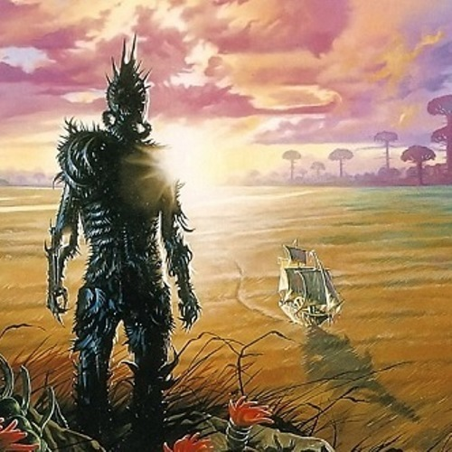

# To Friends, Family, and Mentors

Jan. 9, 2017

Comrades,

I have decided to write this update email to keep in touch with you. If you don’t want to receive these emails in the future, let me know. Hopefully, I’ll write an update every few months.

In June of last year, I graduated from high school having committed to MIT with a gap year. The gap year is a year-long break from systemic education. A variety of factors drove this decision, but mostly, I guess I just wanted to do something different.

I started off my ​summer​ with reading. During high school, outside those assigned in English class and those related to contest math, books usually stayed put on my bookshelf. I also picked up piano again over the summer with a few Chopin pieces and anime soundtracks, but unfortunately wasn’t able to continue practicing through my internship and travels. My grandparents stayed with us in Utah over the summer, and with them and my parents, I visited a slew of cities on the East coast as well as some national parks. Manhattan’s street culture along with its close proximity to almost everything was particularly attractive.

One of the books I read over the summer was the Hyperion Cantos, a sci-fi series. Being a big fan of the time travel genre, I greatly enjoyed the time mechanics and the futuristic setting. However, the author’s obsession with John Keats and the unnecessarily sexual passages drove me to dislike it. Eventually, I decided to drop the series after the first two books, mainly because the science was becoming too unrealistic. Part of the reason for that might have been ​due to reading Hawking’s A Brief History of Time just prior to beginning Hyperion. Other books I read, all of which I greatly enjoyed: Mankiw’s Principles of Economics, Isaacson’s The Innovators, Feynman’s Surely You’re Joking, some Sherlock Holmes and Lovecraft, Bulgakov’s Master and Margarita, Nietzsche’s Thus Spoke Zarathustra, Nehru’s Glimpses of World History, and Gleitman’s Psychology. The last few I am still reading; Glimpses of World History is particularly thick.

After summer ended I began my first internship at a local company called Lucid Software. Starting off as a QA automation intern, my job was to maintain a set of tests to ensure they didn’t fail and if they did, to determine if it was a false positive or if there was an actual problem to report. Considering that the open-source testing framework, Selenium, was slow to run and debug, the job wasn’t my ideal learning experience. Luckily, Lucid was hosting a programming contest at the conclusion of the first week of my internship as part of their recruitment process at two local universities BYU and U of U. I also happen to be pretty good at competitive programming, ​and won the contest. Following that, I managed to negotiate myself into a position where I spent half my time with the software engineers, and the other half on QA. During those few weeks, I learned much about the process, tools, and conventions involved in industry software engineering. Though I was grateful to have had such an educational experience, I still wished for something a little different, something that made me really uncomfortable. The people at Lucid were nice enough to let to transfer over to Sales near the end of my internship, a department with which I was wholly unfamiliar, and help with one of their database projects. The VPs would often chat close to my desk, and I was allowed to shadow at a few of their trainings and meetings. There, I made many good friends and learned much about the company, the sales process, and life. It was pretty great. Unfortunately, I had to leave my internship during December, for I had other trips planned.

Back in Thanksgiving, I visited Hawaii with my parents. No one drowned in lava during our round of the typical Hawaiian vacation activities, though on one hike, we came within a few centimeters of flowing magma. I accepted a position as a computer science teacher at a week-long winter camp called A-Star in San Jose the week before Christmas, and decided to visit Corvallis, OR a week prior to the teaching job, where I had attended elementary and middle school. In that week, I met with long-lost friends near OSU and Stanford. I also made the pilgrimage to the Googleplex! The other teachers at the A-Star winter CS camp all had fairly impressive resumes. Teaching and observing the students’ actions, thoughts, and behavior was intriguing as always. I taught the beginner level class, and even after the experience, I still maintain my preference to teach higher-level classes, primarily for the deeper discussions with advanced students and insights gained while teaching, which happens less in introductory classes. After the camp, I traveled to Fairbanks, AK with my parents. We saw a faint aurora during the nights we were there, and also went dog sledding.

Over the past months, I’ve also watched a good amount of anime. The ​Garden of Words stood out in terms of animation quality. Kantai Collection, about anthropomorphized​ ​Japanese WW2 warship girls (it’s not that weird) participating in historical battles, such as Midway​, ​was particularly difficult to watch, ​possibly due to my status as a Chinese living in the US and the unexpectedly​ bleak plot developments. Still, it was inspiring. The anime I enjoyed the most by far was Ergo Proxy, for the philosophical discussions and references, character designs, and soundtrack.

​I don't have much planned out for the remainder of my gap year. Travelling internationally is definitely one of the things I wish to do, but there is still much to work out. Currently I'm investigating potential opportunities in China, perhaps involving ping pong, as well as looking to attend summer Comiket in Japan if schedule permits. Maybe I’ll learn to drive get a driver’s license.

If you did read through to here, thanks, I guess. It's been a pleasure to know each and every one of you, and I hope that through my periodic updates we'll be able to keep in touch, even over many months and miles.

晏扬\
Yang (Gilbert) Yan

PS: My LDS missionary friends, who too face the difficulty of maintaining connections, inspired this email idea.
