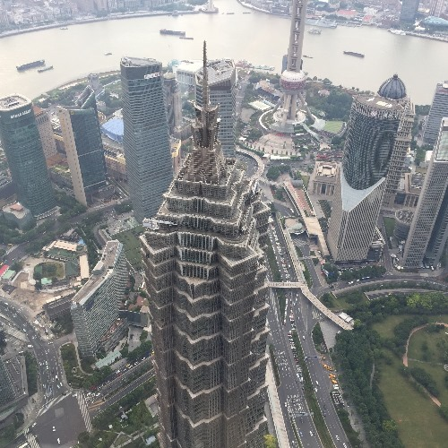
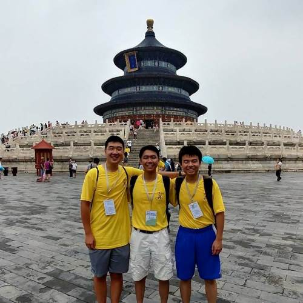
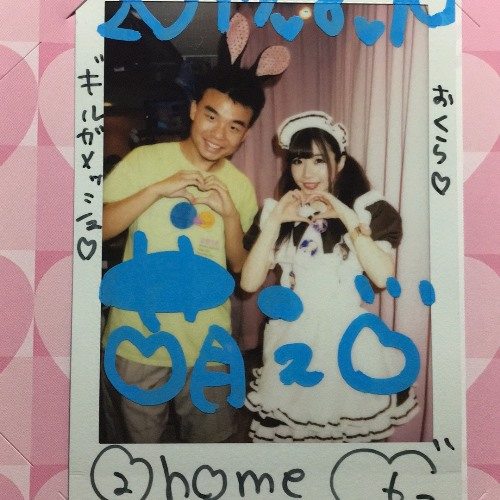
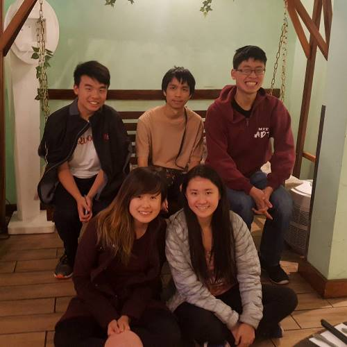

# To Friends, Family, and Mentors

Mar. 4, 2018

Dear all,

I am excited to announce the second iteration of my newsletter/life update! If you don’t want to receive these updates, please email me back to let me know. These updates, and much more, are also available at my website <http://www.emilia-tan.com/#794>, where there are additional pictures and an official way to sign up for future emails! I’ll try to cover everything I’ve done from around the beginning of last year to now, as concisely as possible.

After returning from Alaska in early 2017, I settled down at my home in Utah. Three tumultuous months of internships, travel, teaching, and visiting friends led me to believe that it wouldn’t be long until something called me away from home again. I retreated into my shell of comfort with programming projects, the greatest being a web server written from scratch in C++ and WinAPI, which now hosts my website. For the next four months, I occupied myself with programming, piano, reading, games, and two short trips to San Diego and Seattle. My parents decided to buy a young poodle in mid-March, and named it “Mesh”, which, along with my nickname “Gilbert”, alludes to the ancient king Gilgamesh.

While I recognized the value of four months of free time, I failed to utilize it well, and I regret wasting such an opportunity very, very much. Two years ago, an anime by the name of Ping Pong the Animation inspired me. It told the coming-to-age story of a few boys through their experiences in a competitive ping pong environment. Travelling back to China to visit family felt almost like an inevitability to occur sometime during my gap year. So, on the 17th of May, I left for a three-month trip to China with family and ping pong in mind.

Over the next three months from May to August, I attended 3 summer camps, travelled 9 cities (广州 GuangZhou, 长沙 ChangSha, 珠海 ZhuHai, 天津 TianJin, 厦门 XiaMen, 上海 ShangHai, 成都 ChengDu, 北京 BeiJing, Tokyo) in China and Japan, trained for more than 200 hours for ping pong, and made an uncountable number of new friends. More than any of the activities I did, the souvenirs I bought, or the landmarks I visited, I enjoyed getting to know the people: from family to family friends, from mentors and coaches to college-age peers, each person’s experiences allowed me to understand the world and myself a bit more. At the end of it all, however, was the realization that something fundamental about my identity distanced me from both my peers who grew up in China and those with a more Chinese-American background. I think that’s the natural conclusion to draw when conversing with the parents through a generation gap is far easier than with the child.

It was really a dream come true to have been able to play ping pong for hours each day. I really miss the take-out and bike-sharing, as well as the general weather during those weeks in 珠海 ZhuHai. Akihabara, the canonical center of anime culture, and Comiket, the largest anime convention around the world, had only been words I had heard about in anime until my trip to Tokyo in early August. While Japan is also known for its exotic food, I really enjoyed even the convenience food during my week there. At the center of all my travels was 广州 GuangZhou, where my grandparents lived and I was born. It truly felt like home in between all the flights and trains. I miss the banyan trees there.

Just a few days after returning to Utah, I left for my first term at MIT. Classes have generally been disappointing. My experiences at Waterford, with ~60 students per class, really contrast with the ~1000 people per class at MIT. Of note are the surprising number of friends I’ve made at an arts pre-orientation program I attended and ADT, a dance group on campus. During January, MIT also holds a short, month-long term in which I participated in a robotics competition with a team, helped TA a Java class, and attended a medical interpreting class. All three were insightful experiences, even though we did not win the competition, the Java class turned into a mess, and I did not pass my interpreting license exam. There are many other things I can say regarding MIT, but this is neither the time or the place to write them.

One of the books I read in the past year that I really loved was titled The Mists of Avalon. It reimagines the Arthurian legends from mainly the perspective of his half-sister Morgaine, putting Arthur’s court and related characters from Avalon in a new light and calling into question the meaning behind the actions of traditionally one-dimensional characters such as the Lady of the Lake and Arthur himself.

Of course, as always, I will now write a little about the anime I’ve watched this past year. At the beginning of the year, I watched Sakamichi no Apollon, a short, drama-filled bildungsroman following two teenage boys and their love for jazz. Then, there was Made in Abyss, the Crunchyroll anime of the year, which presented, very beautifully, a story of adventure which did not hesitate to break the arms of little children if necessary. Finally, there was Chaika, a tale about a girl searching for the meaning behind her creation, set in a wonderfully crafted fantasy world. It’s also the origin of quite a few memes.

If you’ve read this far, thank you! I know I’ve promised this report for a while now and am delivering quite late. But, I still believe it is one of the best ways to stay in touch with friends far, far away. There will be more updates in the future! Best of luck to the rest of your 2018,

晏扬 \
Yang (Gilbert) Yan
