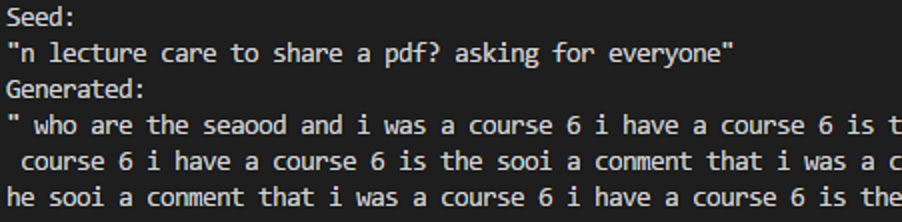
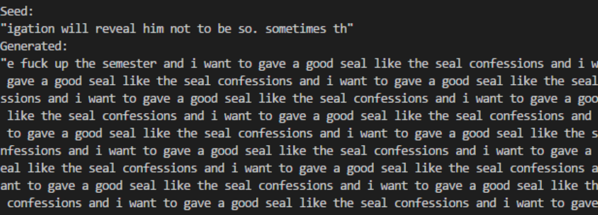
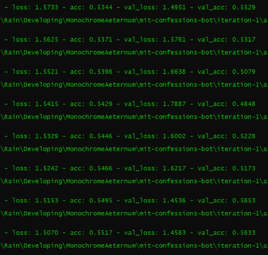
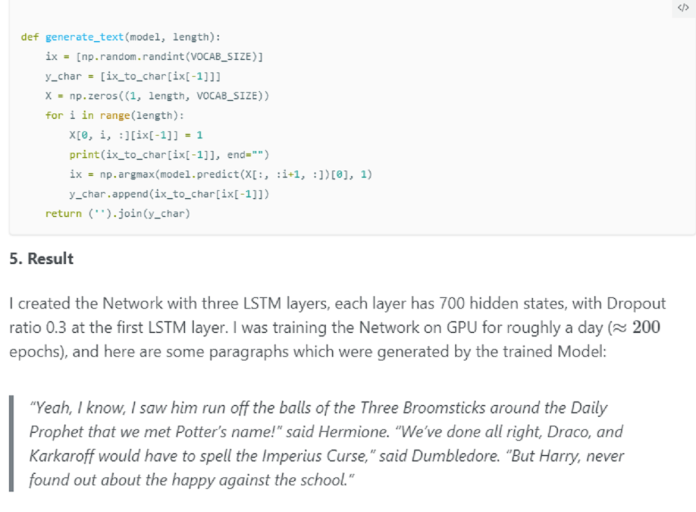

# Predictive Text RNNs and n-grams for MIT Confessions

Jun. 29, 2018

There are few things more human than language. Inspired by Karpathy's famous [RNN Post](http://karpathy.github.io/2015/05/21/rnn-effectiveness/) and my recent acquisition of a high-end GPU, I decided that it would be a good time to gain some hands-on RNN experience myself.

## Overview

In this project, we will be training predictive languages model following the MIT Confessions Facebook pages. The model should be able to generate unlimited confessions posts given an initial seed sequence of text. In addition to a character-level RNN model (`char-RNN`), I also trained a char-based n-gram model (henceforth referred to as `char-n-gram`) which I will also contrast with the `char-RNN`.

In this post, I will focus on practical technicalities regarding the models rather than the mathematical background. There exist numerous resources which cover the latter.

## Data

### Sources

Any ML project begins with data acquisition. Namely, there are three such pages:

* [MIT Confessions](https://www.facebook.com/beaverconfessions/) (henceforth referred to as `mit`)
* [MIT Timely Confessions](https://www.facebook.com/timelybeaverconfessions/) (henceforth referred to as `timely`)
* [MIT Summer Confessions](https://www.facebook.com/MITSummerConfessions/) (henceforth referred to as `summer`)

At one point in time, I did consider using confessions pages from other colleges - however, while this would allow us more datapoints, the increased diversity would surely make training the model more difficult. Moreover, I would lose anything which made MIT Confessions unique.

A brief look at our sources nets us some important observations:

* `mit` has the most posts, then `timely`, then `summer`.
* Each has differing levels of current activity.
* There are varying amounts of non-confession announcements mixed in on each page.

### Acquisition (Scraping)

I am not familiar with Facebook's Graph API, and my latest interactions with it have proven difficult. As data acquisition will not be a common process, using Selenium here was likely a good choice. Selenium offers the benefits of a very low learning curve, as well as visualization of the scraping process. However, I still encountered a few problems at this step, which I solved over a few iterations:

* **Infinite scroll**: Facebook pages don't load all their posts at one time, but rather (mostly) chronologically. In order to reach the oldest posts, one must scroll down pretty far. Selenium doesn't have an easily accessible "wait for scroll to load" function, while a constant sleep duration would crash if there were connectivity hiccups and cause the process to be unnecessarily slow otherwise. Here's what I did:
	* Scrape posts as I scroll the page, and delete the post element once scraped: This prevents Chrome slowdowns from a very large DOM in memory.
	* The DOM id `www_pages_reaction_see_more_unitwww_pages_posts` only appears when there's more posts to load. So, scroll down while this id exists.
* **Long posts**: Moderately long posts are initially collapsed under a `See More` link. There are many attributes to each post which contain the post text, but most of them insert a `...` at the place of the `See More` link into the raw post text. The trick here is to first click the `See More` link (css selector `a.see_more_link`) and then scrape the `outerText` attribute of all `p` children of the post element, which avoids the `...` problem.
* **Extremely long posts**: These posts don't have a `See More` link but rather a `Continue Reading` link, which would open a new tab with the full post. I decided to disregard these posts, since they were few and far in-between.
* **Non-text posts**: Since we're working with characters here, simply discarding these posts was fine.

As a side, I also scraped the time at which posts were made from the css selector `abbr._5ptz`. You can find the raw scraped data, in JSON, [here](mit-confessions-simulator.md-assets/data-raw.zip).

### Cleaning & Preparation

*Anything without a confession number is trash. For this project, at least...*

In preparation for training, I made a few design choices:

* **Confession numbers not removed**: Not too impactful in the long run; perhaps even beneficial to RNN training, considering that strings like `#1000` are strong indicators of a post beginning (beyond the special character to be added at post ends).
	* **char-n-gram**: Confession numbers were removed for this model, as they would most definitely make the model less robust.
* **Uppercase letters converted to lowercase**: I'm fairly certain this makes both the `char-RNN` and the `char-n-gram` easier to train, since it reduces the alphabet size. However, on the flip side, capitals are usually strongly favored after periods, so the char-RNN might learn
* **Charset restricted to this regex**: `[a-z \n\'\.,?!0-9@#<>/:;\-\"()]`. Again, this restricts the alphabet and would make the models easier to train.

The flipside of the latter two design choices above is that they restrict the alphabet of generated samples. In my case, this wasn't top priority to capture the intricacies of MIT Confessions language.

In order to have the model be able to write new posts, it is necessary for the model to be able to recognize post ends. Thus, I concatenated all cleaned posts into one large string to serve as the training data, each post being separated by a `\0` (NULL) character. Post order was randomized. [This](mit-confessions-simulator.md-assets/data-concat.zip) is the concatenated file of posts with the confession number, which was postprocessed to remove the confessions number in each post. These strings served as training and validation data for both the `char-RNN` and the `char-n-gram`.

Data from all three sources combined totalled just over 1MB.

*My friend Kevin comments on the project :(*

## Char-RNN

### Basics

* **Hardware**
	* CPU: Intel Core i7-7600U
	* GPU: Nvidia GeForce GTX 1080 Ti (external; Akitio Node; TB3 w/ 2 PCIe lanes)
		* eGPU bandwidth did not appear to be a bottleneck; raising batch sizes (under memory limits) still resulted in faster epoch training times.
	* Memory: 16GB
* **Framework**: Keras, Sequential Model

#### Training, Validation, and Test Data

Given the input dimension (henceforth referred to as `sequence length`) of the network, datapoints were generated by sliding a window of length `sequence length + 1` over the input string from the last section, with the  `sequence length` prefix serving as input and the final character in the window serving as the label.

None of the models used test datasets, as is customary of RNNs.

The first two models did not use validation sets; however, the third model repurposed `10%` of the training data as validation. The validation data was chosen randomly from all the training datapoints. In hindsight, this would not prevent overfitting very well, as most of the training data inputs would overlap in some way with the validation data inputs due to the nature of the sliding window method of datapoint generation.

The first model was trained on data on earlier scraping & cleaning iterations, which had a smaller alphabet and confessions number removed from post beginnings.

### Temperature

[Temperature](https://cs.stackexchange.com/questions/79241/what-is-temperature-in-lstm-and-neural-networks-generally) is implemented as a `Lambda` layer before the final `softmax` layer during sampling, which condenses or expands the distribution of pre-softmax activations. Lower temperatures lead to more consistent, less creative samples, and higher temperatures lead to a more confident model and more experimental samples.

Temperature was not implemented during sampling for the first model.

### Sampling

Samples require a seed sequence of a specified length. Seeds were chosen as random contiguous sequences of the training data for all three models. Each time a new character is generated, it is appended to the original seed, the oldest character of the seed removed, and the seed fed back into the RNN for the next character.

Each `char-RNN` model outputs a distribution of probabilities for each of the 55 characters in our alphabet as its prediction for the next character. The first model originally used `argmax` on this distribution to predict the next character, which resulted in very repetitive patters. Sampling in later iterations of the first model and later models simply picked from the distribution itself (`np.random.choice`) which results in more realistic samples.

## First Model: 2x256 LSTM

This model was trained with an earlier iteration of data cleaning, with a smaller alphabet and without confession number prefixes.

### Layers

1. LSTM: 256
2. Dropout: 0.2
3. LSTM: 256
4. Dropout: 0.2
5. Softmax

Largely based on [this](https://machinelearningmastery.com/text-generation-lstm-recurrent-neural-networks-python-keras/) post.

### Other Specs

* **Optimizer**: `adam` (`lr` = 0.001)
* **Loss**: `categorical_crossentropy`
* **Input sequence length**: 50
	* This is both the length of the seed text for sampling as well as the input dimension into the network.
* **Batch size**: 64
	* Small batch sizes slowed down training when compared to later models. However, smaller batch sizes are less prone to overfitting while large batch sizes might lead loss to converge at a higher value than the true minimum.
* **Validation**: None

### Final Model

* **Loss**: 1.530 training, N/A validation
	* Loss plateaued around after epoch 40 - it appeared that we had reached convergence.
* **Epochs**: 43 out of 50 planned
* **Samples**
	* [10000 characters sampling from the output distribution](mit-confessions-simulator.md-assets/first-model-sample-10000.txt)
	* [10000 characters with `argmax` on the output distribution](mit-confessions-simulator.md-assets/first-model-sample-10000-argmax.txt)
	* Posts are delimited with `\n----------------\n` for easy visual cues (instead of a `\0` character)
	* The first model was trained on data with a slightly smaller alphabet than later models and no confession numbers in posts (hence the lack thereof in samples).

### Thoughts

*A distinctly MIT flavor.*

Samples generated from this first model were largely repetitive due to the lack of temperature and using `argmax` during sampling. However, this does not mitigate the concern that loss plateaued at a high value. Given the small batch size and the high loss, I should have realized this was an indicator that the network was not big enough. Instead, I stupidly made the network more shallow instead for the second model.

Here's a *sample* of the final `argmax` model's samples:
>  the same oriniog that is the same of the students
that i was a lot of the sime in the sime in the sime in the sime in the sime in the sime in the sime in
the sime in the sime in the sime in the sime in the
sime in the sime in the sime in the sime in the sime in the sime in the sime in the sime in the sime in
the sime in the sime in the sime in the sime in the
sime in the sime in the sime in the sime in the sime

You can imagine how the rest look. When I fixed the `argmax` problem, samples became much better:

> howrd everyone i couldere i keep hnuosabled for eri's phosopgte or hoe down for people. is got it soorpr not j'm mit iust anyone lats from inpsitiese and i
slng that and mey ard all! to trasenlac that sam bre me mayba and has les me eorng dla. to won could nedf an aslowing adout to agfresabze where i pnly fuck
tp get intoxarf mikh tieer in.

> lymeroliiise event
eisier atadoed to she gaprie  inttende of it and you happen. j had srch a fresh criviced was is provicegc in tec waserinns of how the beceb im loot soot

> all that there years are jislu. i want to tuak off uhis weats. baf that i jnow that miw means the eyyreied people could inttead it to gigrres someone to tp
bef, but you'se beeo in sa! lit lasieur teams of shoutoi of this ostglng ciefeent and rou.  danlct and mos lore ciange hnw to and beeot shyatid lore aftween b lpgean on confessions oues

Okay, I guess \'better\' is relative. At least some words are legible here, and there is some sentence structure.

Don't worry, samples get better with the incorporation of temperature in later models.

*Not sure where the seals came from...*

## Second Model: 1x512 LSTM

### Layers

1. LSTM: 512
2. Dropout: 0.4
3. Softmax

I thought perhaps the high loss was due to the 2-layer network being too difficult to train, so for the second model, I (mistakenly) reduced the network to just one layer.

I don't believe dropout affects loss minima, but only the time required to reach it. In smaller models with just `summer` data, it seemed like a dropout of 0.4 resulted in the fastest loss convergences.

### Other Specs

* **Optimizer**: `adam` (`lr` = 0.001, `lr` = 0.00001 after epoch 18)
	* Loss plateaued at ~1.814 around epoch 18. Learning rates too high might lead to loss convergence at a value higher than the true minima, which learning rates too low will still converge to the true minima but slower. Since loss was already plateauing, I decided to lower the learning rate in case we were not approaching the true minima. In hindsight, this was the right move.
* **Loss**: `categorical_crossentropy`
* **Input sequence length**: 150
	* Input sequence length was increased from the last model mainly because Karpathy's RNN mentioned using a sequence length of 100, and 150 would not hurt the potential of the model but only training speed. Moreover, larger sequence lengths (network input dimensions) would utilize GPU parallel processing better, and would not slow training down by that much in this case.
* **Batch size**: 256
	* Batch size was increased to speed up training at the risk of overfitting. Batch sizes larger than 256 did not offer significant speedups to training.
* **Validation**: 5% of training datapoints
	* It should have been helpful to split the training data into training and validation data, especially to prevent overfitting with the larger batch size.

### Final Model

* **Loss**: 1.681 training, 1.570 validation
	* The lower validation loss might be a result of the high correlation between training and validation data along with the inherent randomness.
* **Epochs**: 22 out of 100 planned
* **Samples**: Unavailable.
	* Samples aren't very interesting here with respect to the two other models.

### Thoughts

*Shhh, the model is training!*

Unfortunately, loss seemed to converge at a higher number for this model than the last. Samples generated were significantly better, however, with the incorporation of temperature and choosing from the output distribution. I found `0.35` to be a solid temperature choice for the final iteration of this model.

## Third Model: 2x512 GRU

Feeling a bit stumped after the last model, I gave my friend **Tony** a call and he offered me a few hyperparameter suggestions for this third model regarding network architecture, GRUs, batch normalization, and learning rates for Adam.

### Layers

1. GRU: 512
2. BatchNorm
3. Dropout: 0.4
1. GRU: 512
2. BatchNorm
3. Dropout: 0.4
4. Softmax

It's commonly assumed that batch normalization is a low-cost way to prevent internal covariate shift; however, recent research suggests otherwise. Regardless, batch normalization is considered non-harmful and usually helpful.

I am not familiar with the mathematics behind GRUs; however, research suggests that they do not lower the potential of a network compared to LSTMs while being much faster to train. This was indeed the case, as this two-layer network trained just as fast as the one-layer network from the second model.

### Other Specs

* **Optimizer**: `adam` (`lr` = 0.0003 ([Karpathy constant](https://twitter.com/karpathy/status/801621764144971776?lang=en)))
	* Seems like `3e-4` is the commonly used learning rate for `adam` as opposed to the original paper's suggestion of `0.001`.
* **Loss**: `categorical_crossentropy`
* **Input sequence length**: 100
	* Lowered from previous model to speed up training; impact is probably negligible.
* **Batch size**: 256
* **Validation**: 10% of training datapoints
	* Due to the correlation between training and validation datapoints, validation loss probably was not a very good indicator of overfitting. However, some validation is better than none.

### Final Model

* **Loss**: 1.426 training, 1.364 validation
	* Loss was nearing convergence, but likely still had a bit to go. Unfortunately, validation loss was not following, suggesting an overfitted model. However, sampling suggests otherwise. I should have kept on training, but I ran out of patience.
* **Epochs**: 46 out of 100 planned
* **Samples**
	* [10000 characters at `temperature = 0.15`](mit-confessions-simulator.md-assets/third-model-sample-10000-0.15.txt)
	* [10000 characters at `temperature = 0.35`](mit-confessions-simulator.md-assets/third-model-sample-10000-0.35.txt)
	* [10000 characters at `temperature = 0.80`](mit-confessions-simulator.md-assets/third-model-sample-10000-0.80.txt)
	* Again, `\n----------------\n` was used to delimit posts rather than `\0`.
	* As expected, lower temperatures result in much better spelling than higher temperatures.
	* Sampling speed isn't great, partially because it isn't a parallel operation (this not suited for the GPU) and my CPU isn't top-tier.

*Praying for loss to continue decreasing...*

### Thoughts

With the right temperature, generated text quality seemed to be on par with Karpathy's models. I think, even if I trained for more epochs, I wouldn't see too significant of a rise in quality. Tony's suggestions were very helpful in knocking down loss to this level.

Unfortunately, even at this point, generated text still fairly unconvincing compared to text from the `char-n-gram`, which we will go over later.

Here's some samples at `temperature = 0.15`:

> #13678 i'm a great minute of my best friends and i'm so much to be any and i am an ackint of my friends, i'm sorry that i'm so friends.

> #2355 i'm so many of my friends and i'm a great person who have a course 6. the best of the most people
who want to be and i don't know what you don't know
what i'm so much and i'm so much and i know i'm so much from my friends who want to be able to be any other people who have to mean i'm so because i'm sure
i was any groups and i want to get any other people
who don't know why i'm so many things and i'm so much from the best because i'm so better and i'm not any and i don't know what to do the fuck up and i don't know what i'm so confused to get anything and i'm
so from the world.

> #13668 i'm so friends and i want to be able to be able to be able to make me and i'm so graduating that
i'm just a better from any makes me and i'm so better and i'm not me.

Lot's of simple, correctly spelled words. Sentences are pretty runny, which is likely completely caused by the low temperature. Here's some samples from `temperature = 0.35`, which is currently in deployment:

> #6329 i get to still have to get to get the professor to leave the like my best friend. i'm so friends and they will be at me and i haven't go out of my friends.

> #9223 i'm a great confessions and i wish i got the problem and i was the really because i don't know how to be meaning in the best one of the police that you're not being an anyone seriously when i don't know what i'm just care and i can't help them and i can't help the fuck my best friends, i don't know what i was any of my friends.

> #1467 i feel like i'm a lot of the life and i'm just too great the fuck on the grades of the whole problem.

There's more variety at this temperature, and most words are spelled correctly. I'd say this is on par with Karpathy's Paul Graham generator:

Here's `temperature = 0.80`:

> #14696 hel! not is io the got window is at mong respect her and two and republiter?

> #9237 @l ase the foroground from sexual the first part year who can cester to have to cuy me wolen.

> #1314 i like goristealy, a weeked in my person. when you nade the best any all let those girls.

> #11462 you know most their junior since if i could have angry harder like this and im a general person who i feel and anyone like kooking me

As expected.

## Char-N-Gram

Directly implemented from [this](http://nbviewer.jupyter.org/gist/yoavg/d76121dfde2618422139) post, in which they refer to the model as a \"Maximum Likelihood Language Model\". The math is pretty straightforward.

The primary hyperparameter of this model is the input sequence length. A larger `sequence length` gives more convincing but less creative generated text (similar to an overtrained RNN). In deployment, `sequence length = 15` currently, but I am considering tuning this down in the near future.

Since the `char-n-gram` was trained with data without the confession number, a random confession number in `[1, 15000]` was prepended to generated posts for deployment.

### Samples

* [10000 characters at `sequence length = 5`](mit-confessions-simulator.md-assets/char-n-gram-10000-5.txt)
* [10000 characters at `sequence length = 10`](mit-confessions-simulator.md-assets/char-n-gram-10000-10.txt)
* [10000 characters at `sequence length = 15`](mit-confessions-simulator.md-assets/char-n-gram-10000-15.txt)

Here's some samples from `sequence length = 10`:
> #7582 turns out almost everyone can smell the roses
type. my family would ever think to myself...

> #12110 would you automatically makes me uncomfortable and relax, and not the only one :(

> #12539 honestly answered, no, this is about your lack of boy friend. so a friendly and stuff. but then i decide to go to the consulate officer, only that in my case it was important to be course 14, 17, 24 topics); is there anything i did before, but it's an icosahedron, not a dodecahedron.

> #10836 i want to attend your showcase/concert/w.e (and especially one--you've said some pretty misogynistic sexual encounters we had. i'll get much harder to be a competition to the class of 2018, get these rings delivered in ganja style!

## Deployment

I chose `temperature = 0.35` for the `char-rnn` model and `sequence length = 15` for the `char-n-gram` model for deployment.

Sampling from either model is computationally cheap, so I have generated around 1.2MB of text in total from the two models, at a ratio of around 1/3 `char-rnn` posts and 2/3 `char-n-gram` posts. Posts will be posted to a Facebook page at a rate of 1 post/hr. While Graph API would be preferred here, it turns out that acquiring a suitable long-term API key is non-trivial and requires approval. So, we use Selenium instead (again...).

The `char-n-gram` model has a tendency to replicate previous confessions posts with longer `sequence length`s. Generated posts which were the same (except the confession number, of course) as training posts were discarded.

The page is live at [MIT Confessions Simulator](https://www.facebook.com/mitconfessionssimulator/). The pre-generated posts should last around 6 months at this pace.

## Final Thoughts

[Github repo w/ source code](https://github.com/GilgameshxZero/mit-confessions-bot). Some code was taken from [this post](https://machinelearningmastery.com/text-generation-lstm-recurrent-neural-networks-python-keras/).

Generating convincing predictive text is deceptively difficult. Unfortunately, the `char-RNN` didn't perform too well compared to the `char-n-gram` here. Given more data, perhaps, we could hit an even lower loss with the RNN. However, that still is no replacement for the wit captured by the `char-n-gram` model, which would also perform much better with more data.

Another option would be to have used word-based rather than char-based models. However, I did not have the time to look into this.

`argmax` vs. sampling from the output distribution and temperature turned out to be hugely important. My concern is with [blog posts such as this one](https://chunml.github.io/ChunML.github.io/project/Creating-Text-Generator-Using-Recurrent-Neural-Network/), which clearly uses `argmax` but still generates non-repetitive samples. I'm no RNN master, but those results look fishy to me:

Given, Trung's network is reasonably bigger than mine - but I don't think that would offset the effect of having `argmax` to create such variety in samples.

Well, now it's finally time to jump on the RL & adversarial bandwagons I guess.
