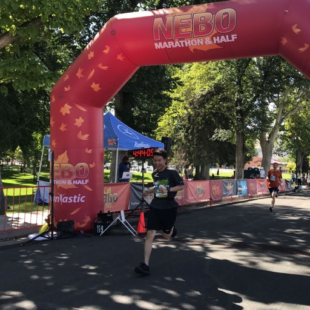
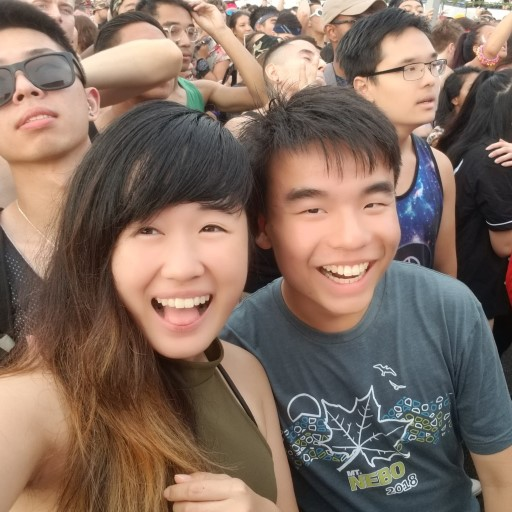
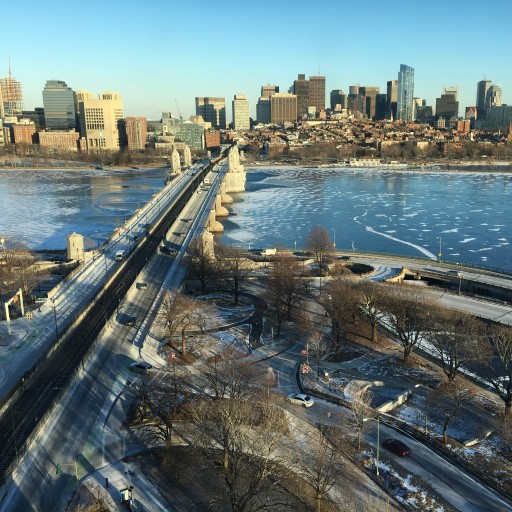
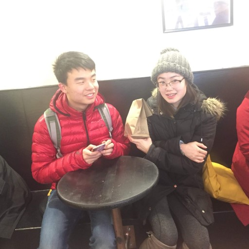

# A Deluge of Experiences

Mar. 25, 2019

Dear all,

Happy spring break (or late spring break… or adulthood…)! This is my third life update, in which I reflect on events that transpired around me over the past few months. You can find the rest of these updates at <http://emilia-tan.com/#mailing-list> and manage your subscription at <http://emilia-tan.com/#home>.

The end of my freshman year at MIT approached fast after my last update a year ago. I hadn’t been too incentivized to find an internship in the fall and did not match with one in the spring either. Looking for something to do, I joined a trading startup named Inmensus with three of my other friends. The one who had introduced me was Tony; I had met him a few years ago teaching at the A* computer science camps and realizing our similarities during our time together at MIT had only strengthened our friendship. We started ideating early in April and officially registered in May. Inmensus focused on algorithmic trading in cryptocurrencies. Designing and setting up the infrastructure to make everything work well was a challenging task. Soon enough, we had collected enough data specific to our market to perform some basic analysis. However, it was only very barely possible to find a model which would generate profit for us. In the end, the original founder and Tony and I disagreed on the the future of the company, and we left the company in September. Unfortunately, I did not learn as much from the experience as I had hoped. Still, I find it difficult to speak about this experience objectively; though, I have attempted to adjust accordingly and found an internship earlier this fall.

Motivated partially by an external factor (which I will get to), I also decided to run my first marathon over last summer. Training from 30-40 miles a week, failure to give my body enough time to adapt eventually led to a stress fracture in my right fibula in late July about a month before the race. Three weeks in a boot later, I decided to continue training for the marathon against the recommendations of the doctor. I ran the Mt. Nebo marathon in late August, focusing my weight on my left foot especially during the downhill portions, and finished in just under five hours. Undoubtedly, this time would have been lower had my injury been fully healed and had I not missed three weeks of training. Regardless, it feels good to have this under my belt, serving as a source of inspiration to myself during longer nights.

For the longest time, I had wanted to attend a music festival, ever since getting into EDM in late middle school. A few days after the marathon, I arrived in New York and met up with Cynthia, one of the very first friends I had made at MIT through whom I had met so many others, to attend Electric Zoo, one of the many EDM festivals. More so than at any other event, dancing together was unexpectedly exciting. The music wasn’t particularly to my taste, but it was alright. Its hard to expect much different at a mainstream EDM festival. I am particularly thankful for Cynthia for coming along with me, because without her, my experience surely would’ve included much more anxiety and much less fun. It’s a relief to know that, like others, I am also able to enjoy large social events. I’m excited to attend similar events in the future!

The fall semester of my sophomore year was academically challenging. While there is much to be said about my decision-making surrounding classes, I don’t feel the details are fit for this update. This spring semester is at a much better in terms of class pacing, but as a result slower than I would wish for myself. Over the past year, I’ve come to hit a bottleneck in terms of time, having to balance between developing soft skills against technical ones. Still, many of the classes intrigue me, and given the time in the future, I would do my best to pursue them.

Inspired by the same force which pushed me to run my marathon, I resolved to involve myself in many more of the diverse resources in college. I continued dancing in MIT’s Asian Dance Team (ADT) until just this current term when I was unable to audition due to a conflict, but also joined the trading club Traders@MIT (to which, to be fair, I’ve contributed little) and Design for America (DFA), focused on designing solutions to make local impact. Originally a team member in DFA, I stepped up to lead the team after our original lead left. While the beginning of our project was disorganized and tumultuous, we ended up doing some of the more meaningful things of all the teams. I also joined two research projects (UROPs) in my fall semester. One of these projects turned out badly directed, but I stayed in the other, under the advising of Daniel Jackson at CSAIL’s Software Design Group. This project looks to design paradigms surrounding the deployment of spreadsheets as webpages; though this isn’t quite as technical of a topic as I would have hoped, the work is still interesting, and the group is very supportive. Over IAP, MIT’s January term, I took a software internship at Microsoft, working to build an integration between an open source library and an Azure platform. As expected, the work wasn’t very enlightening, but was balanced well by an increased understanding of the types of pipelines at these larger companies as well as the human interaction. By choosing to spend my time on these activities, I have in turn chosen to spend less time on technical development, for example, from classes. Yet, seeing as I was not able to have many of these experiences in high school, I believe it’s the right investment to make.

However, by far, the most eye-opening experience of my past year was, and is, my relationship. From my confession on the last day of my freshman year before I left for Utah, it took us two more months and a week of no contact while I was on a cruise with my parents (which was a very memorable experience, particularly the waves on the ocean) to finally begin dating in mid-August. A now-senior studying chemistry and chemical engineering at MIT, Angela and I had met through mutual ADT friends (the same friend group as with Cynthia). It was her indecision post-confession which motivated me to pursue the marathon over summer and her host of experiences which motivated me to seek the same over the school year. Never had empathy been so important to me. Through this relationship, I’ve found it necessary to think on so many topics to which I had never realized the need. I’ve also met many new friends and have had the chance to learn about their values and dreams. To me, these are rare but very valuable experiences. Surely, though, there is more to be said than can be said here. And maybe, someday in the future, I’ll be able to reflect on this comprehensively.

It’s also time for a reflection on some of the anime I watched this past year! Over the summer, I followed the remake of Legend of the Galactic Heroes. The original series is by now of legendary status; yet, I have a hard time watching older animation styles. I found this remake enjoyable, with its characters’ differing ideologies relatable and subsequent clashes insightful. On the other hand, the film Big Fish and Begonia, produced in China, brought with it very impressive animation and a well-imagined world of magic, only to be let down slightly by its story. And last, perhaps a guilty pleasure is the currently airing Domestic Girlfriend, a drama-filled (certified spicy) series following a guy deciding between which of his step-sisters to date.

Thank you for reading, and please stay subscribed for more updates in the future. Feel free to reach out to me to chat!

Godspeed, \
晏扬 \
Yang (Gilbert) Yan
