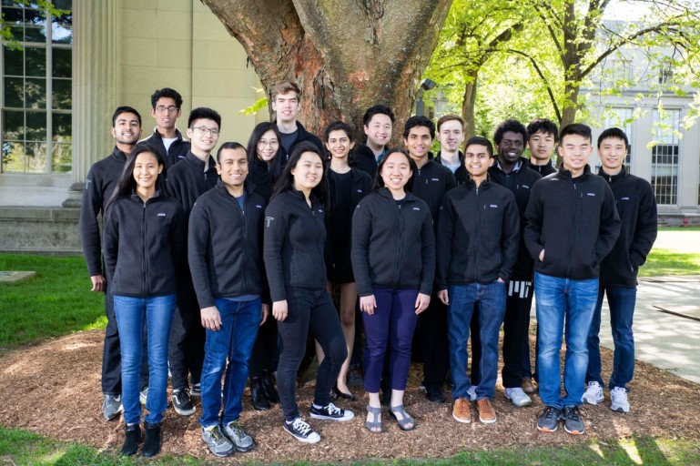
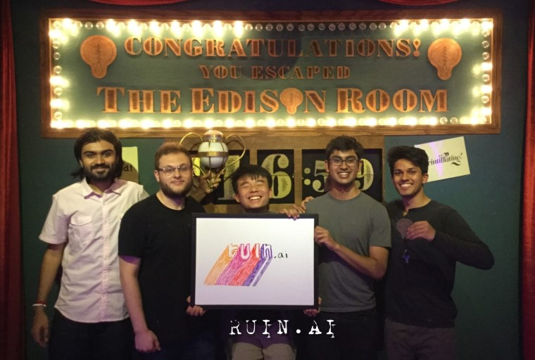
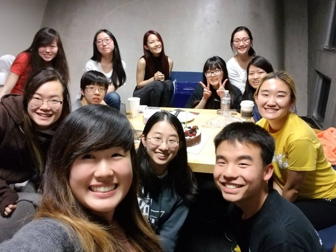

# Purpose

Oct. 15, 2019

Over the past six months, I have repeatedly and exhaustedly questioned my *raison d’être*. Driven not by duty to my family, to religion nor to the state, nor by the pursuit of happiness, I failed to answer satisfyingly when I was forced to ask this of myself, not once, but thrice in the time since my last writing. In this reflective piece, I revisit these moments, providing not only to you an overview of my recent events, but also to myself another chance to define my purpose.

Let’s start with Chicago.

Headquarters to efforts in trading and architecture, the city welcomed me, partway through summer, as an attendee of Design for America’s (DFA) annual summit. At DFA, during my previous school year, I had led one of the undergraduate teams to ideate on and prototype a solution to encourage students to form longer lasting communities and bonds. Our team was met with many logistical issues on the way, and, understandably, I was somewhat anxious heading to the summit. While the design and leadership workshops at the event were in line with what I expected, it was the keynote by George Aye and one-on-one conversations with the speakers which prompted considerable self-reflection. Engaged in leading both the DFA club, which prioritized social impact, as well as Traders, the quantitative trading club, at MIT, I found the focus on sustainability and ethical design at the summit to inspire that part of myself who had even considered applying for DFA at the beginning of last year, but to fall short at penetrating the barriers which guarded my excitement for trading. On the surface, these two clubs could not be any more different. One scrambled to find community partners for funding while the other was rumored to be capable of buying each of its members at least a new MacBook Pro (which isn’t false; but we don’t do that). One’s membership was at least three-fourths female; the other, at least 75% male. Seemingly stretched between two extremes of passion, I am asked to choose: hands-on impact and an ethical responsibility to one's community or a financially well-motivated attempt to reduce liquidity and capture true asset value; the warmth of smiles on the faces of those in whom I see a reflection of my past or the quantifiable truth which feeds into a rationally satisfying meritocracy? At this basic level, I understand why one might choose one or the other. My involvement with these activities, be it DFA, Traders, or human-computer interaction (HCI) research at MIT is an attempt to empathize with those who are passionate about them. To declare one lifestyle to be purposeful, and another not, appears to me to be the antithesis of this attempt — surely, at least some of those who live these prospective lives do it out of personal choice and not out of a lack of options to do otherwise. Neither the declaration of ethical responsibility as purposeful nor the contrary are truth. As such, I find it personally unacceptable to take a stance.

*Traders@MIT club photo (spring 2019).*

One delayed flight later, I returned to San Francisco shortly after the conference to be welcomed back by my coworkers at Scale AI. Co-founded three years ago by Alex, a top competitor in several science competitions in high school and MIT freshman prior to dropping out, and Lucy, a designed-focused Thiel fellow from CMU who had since left the company, Scale had been on my radar since it began attracting top talent from within the science olympiad circles. Delivering the operations and quality control behind large-scale data-labelling projects from customers, mostly in the autonomous driving space, Scale reached unicorn status (a valuation of $1B) over the summer, a monumental achievement for the three-year-old startup. Core to its success was early support from Y Combinator (YC) mentors and connections as well as an uncanny ability to attract an extremely high concentration of industry skill and talent. My choice to join Scale was guided in part by two common reasons why one might choose to join a startup: a desire to experience and discover any passion for "startup culture", or a real interest in the specific startup which might blossom into a future full-time role. The former I posit to have experienced much this summer, between the unicorn celebrations and my end-to-end launch of a new coloring system which rendered me as the unofficial owner of all bugs related to colors. The latter warrants a longer answer. While I worked in the front-end, the four other interns there at the same time worked on arguably more technical projects, be that the back-end or machine learning. At MIT, there is sometimes a sentiment that those who work in non-technical areas do so due to a lack of technical expertise; and that, consequently, the technical experts should deserve more respect for being able to do what others cannot. Admittedly, there is some truth in this: deriving models from messy data requires more specialized training than does building out an aesthetic website for a given user flow, likely due to a difference in learning curves. However, it may not be my responsibility to discern whether one is a more desirable role than another — only to recognize why another may think that way. In deciding where I want to work in the future — or even what role I wish to take on — I have attempted to look past those who choose one or the other out of a lack of choice, be that monetarily or otherwise, to, like before, understand the underlying passion which makes up each choice. In doing so, I believe I have found my own, albeit budding, passion in each, be that front-end or back-end, machine learning or recruiting. A possible intellectual predisposition to a technical field is, to me, no good reason to declare a non-technical job which others find meaningful to be not personally so. Even the feeling of fulfillment in one role, possibly unmatched by any other role, is but a personal failure to empathize with another's passion in another role. As such, it is quite unfulfilling to resign myself to even the most fulfilling pursuit.

*Scale summer interns after Palisade escape room outing.*

*Everything begins and ends in the summer.* As I hurriedly weave the conclusion to an unsatisfying existential crisis I would have done well without, I am inevitably reminded of the many loose threads yet to be joined. The final stop of my summer was, once again, New York City, as I joined my friends Tony, Stella, and Jing, at Hack Lodge, the week-long love child of the well-worn 24-hour hackathon and the prestigious 3-month-long startup incubator, to build an ambitious social app concept of which I will refrain from speaking further until its release. Yet, of all my farewells, be it for my summer roommates and their parties or for the peers and mentors at Scale or Blend or Facebook, be it for the quiet, cloudy days in Bernal Heights or for the head-banging, electricity-filled night at Audiotistic, it was those for my closest friends at MIT which most humbled me of my own mortality. This last month, the beginning of my junior year at MIT, reminded me of very little outside the bittersweet loneliness to which I had been all but ignorant before I had met my friends in the Yellow Lego lounge/living group. Happiness, for me, is not much more than the knowledge that, just a few rooms away, is a place where I am no longer judged for how well I perform, where I no longer feel guilty for the *what-if*'s, *should've*'s, and *if-only*'s. Happiness, for me, is being able to cry, to be vulnerable, to empathize, all while trusting the other person in the room to care just as much after as they did before. When my then-girlfriend and the rest of our lounge graduated, so too did the coin of happiness reveal to me its antipode. Trapped, like a 13-year-old piloting a 20-year-old body, I drowned in the flood of emotions which came with the departures and the breakup. Suddenly, the Monkey's Paw had granted my wish for empathy. I extend my hand, a phantom of love and longing and anger and envy, to that tauntingly bright green luminescence across the water. I claw at the past, searching for a reason, any reason, anyone to blame, for my suffering. I scrutinize every choice I've ever made — I write it down — and next to it, I write down what could have been. But, pages and pages and pages later, I find only fear. I create, in one of the more impressive mental acrobatic feats, life — an entity of the mind, a false creation, a manifestation of perfection — from only the best of the shards of the shattered *orbis terrarum* which make up my understanding of humanity. And to this manifestation I indebt myself and tie my purpose and bind my future, to create a twisted world of determinism where regret no longer has meaning. Finally, absurdity is no more. After all, is there anything more telling of a man than the color of the leather on his passport?

*Yellow Lego and friends.*

In the coming year, I have chosen to focus on the things I do best alone. And, whatever you may be up to, I can only try my best to empathize, and wish you the best of luck.

晏扬\
Yang (Gilbert) Yan
