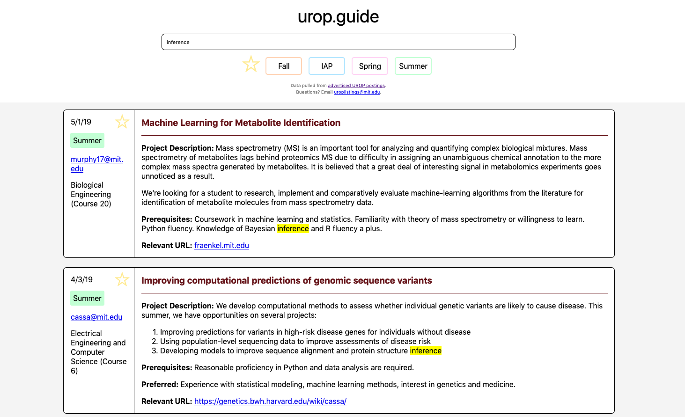
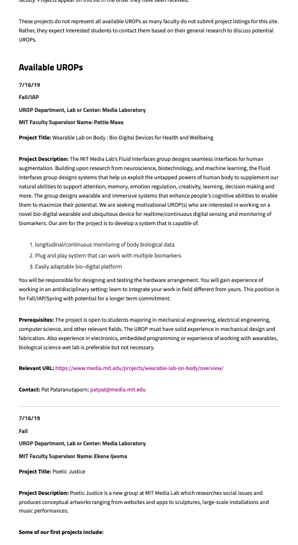
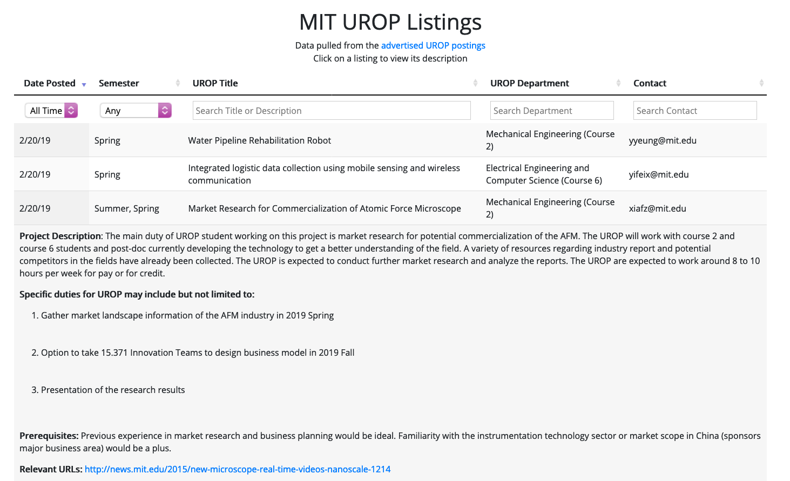

# urop.guide

Jul. 17, 2019

Originally envisioned by [Stella Yang](https://stella-yang.com) as a hackathon project, [urop.guide](http://urop.guide) presents advertised research opportunities at MIT (UROPs) in a much friendlier format than at the [original website](http://uaap.mit.edu/research-exploration/urop/apply/urop-advertised-opportunities) presented by the MIT UROP department.

*urop.guide*

Below, I will briefly present my perspective on the design challenges and choices made throughout the process. Stella also has a short post on her website [about urop.guide](https://stella-yang.com/projects/uropguide.html).

---

Research opportunities for undergraduates at MIT are denoted by UROPs and have been traditionally advertised on MIT's in-house website.

*MIT's original UROP website*

Each UROP consists of several fields for date posted, schoolyear term, department, faculty, etc. There are upwards of several hundreds of advertisements on this website, presented, flat, in a long list.

Our first iteration of **urop.guide** spun out of HackMIT with two other collaborators, [Alisa Ono](http://www.alisaono.coffee/) and Angela Cai.

*The first iteration, hosted at uroplistings.guide*

Built natively with Bootstrap and DataTables, this first iteration showed 8 UROPs per page, collapsed under their identifying information until clicked, at which point they would expand to show the full content. While the structure of the data naturally fits into a table instead of a flat list like MIT would have it, the table-based presentation only complicated user interactions with the page by introducing clicks beyond just scrolling. The ultimate hint that this was the wrong design choice came in the form of the instruction "*Click on a listing to view its description*", presented in the third line in the website.

In an attempt to move away from the tedious scrolling of the original website, we also made the decision to limit the number of UROPs present on each page, opting to append a page navigator at the bottom of the page instead. However, in hindsight, neither page-based navigation nor something feed-like such as MIT's original website is good design. UROPs are inherently advertisements, postings which hold only sparse appeal to those who browse them. To present these advertisements, in order, across multiple pages or in a long feed is akin to Amazon presenting its products in order of listed date only. If I were looking to buy a GPU, I'd have to scroll across countless pages or listings before finding anything remotely relevant.

---

Modern browsers' search functionality was the traditional way most users of MIT's UROPs page navigated the flat list. We tried, in the first iteration, to incorporate our own search bar into **urop.guide**, which expanded upon the browser's search by not only highlighting relevant UROPs but also hiding the irrelevant advertisements. I still believe this *filtering* capability was the right direction; however, the first iteration delivered on this in a nuanced way by incorporating not one search bar, but three, partially as a limitation of DataTables. For the new **urop.guide**, we combined search functionality to search across all relevant fields of the UROPs and maintained our stance on *filtering*.

*The same picture, but notice how we're filtering by "inference" now.*

Returning to the feed-style presentation removes one level of complexity from navigation. While our list is still mostly flat like MIT's, it's presented with two columns per advertisement, grouping related information together visually. Expanding on the idea of *filtering* search, commonly seen on Amazon or Ebay who presents similar content, we added term filters as well as capability to denote and selectively browse favorites, akin to the idea of a "shopping cart".

---

A formal design audit of the current iteration has yet to be conducted, but I can see from an glance some aspects which could benefit from more thought:

* Rounded corners should have more clarity - in fact, only user-interactable elements should have rounded corners, to distinguish themselves from the UROPs, whose current rounded corners present visual confusion around whether they're clickable or not.
* It might be beneficial to remove borders if we can replace them with proper spacing.
* The star icon still feels awkwardly-positioned in the listings.
* Font size in the search bar is to small.
* The extra space on the sides of the listings is potentially wasted real-estate.
* More data analytics could help build better search/filtering functions.
* Needs to scroll back to the top to utilize filtering capabilities - unsure of whether this is the right design choice.
* Click-based expansion might not actually be that bad, as long as it doesn't disturb visual information flow of other advertisements too much.

---

**urop.guide** is hosted by a fileserver on AWS. The data is scraped automatically at an interval from MIT's official website by a Python-based scraper built by Stella. The current iteration is written in native JS. [Repository](https://github.com/stella-yang/urop-website).

Thanks for reading!
