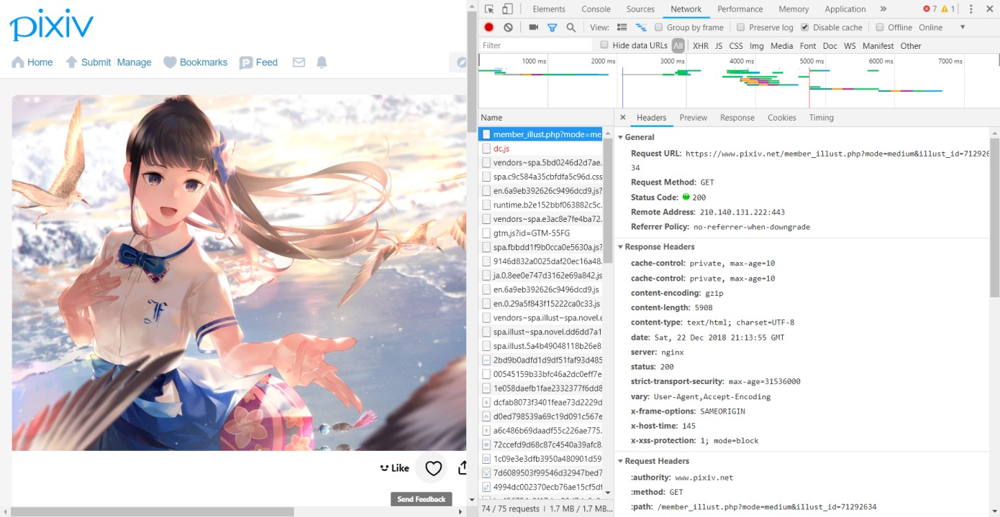
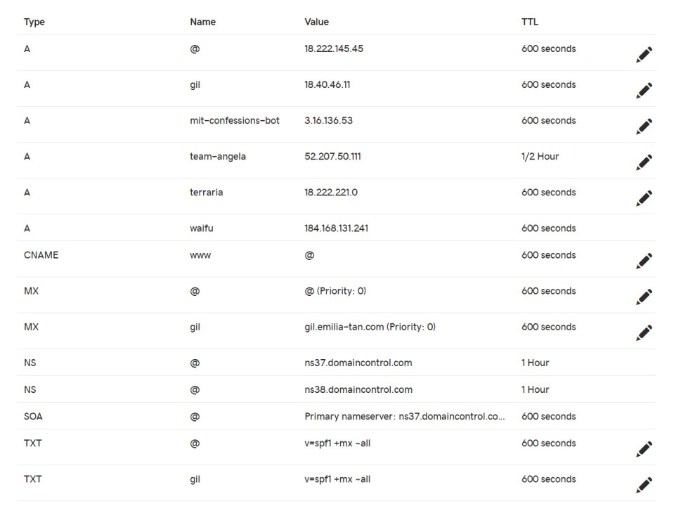

<div class="next-subtitled"></div>

# A Brief History of Emilia

Dec. 25, 2018

Over the course of eight years and many builds, I have come to see a fledgeling desire to steal my father's computer passwords transform into 7000 lines of C++, a sub-par webserver for HTTP and SMTP, and a wealth of experience about low-level WinAPI and network protocols that I'll probably never use again.

Join me on a brief tour of the history of `Emilia`, from conception to discovery to implementation!

This also includes a tour of the evolution of the Rain library, an abstraction layer I've built over the years as necessary.

<video src="emilia.md-assets/emilia.webm" autoplay loop muted></video>
*A smiling Emilia (not the webserver).*

## Early Years with C++

C++ became my favorite language when I came to learn that it was capable to writing every application on a computer I had ever used. Unlike the higher-level languages, which would need to integrate other frameworks to build a complete application, C++ did not need any libraries beyond those provided by Windows to build everything I had used. My early passions for coding stemmed, like many, from a desire to create games like those which had give me so much joy.

### Infection: A Simple Console Game

One of my more complete games, written in 2011, is called `Infection`.

You run a lemonade stand and sell infected food to customers until you kill the entire population. Lemonade consists of three components: lemons, water and ice. The more of those three are infected, the more likely the customers will get infected. There's a bunch of mechanics regarding how the disease spreads and wanes, as well as how much the public trusts the food from your stand.

 It's like taking the worst parts of running an *actual* lemon stand and the Pandemic game and putting them together. Here's a short GIF of the game.

<video src="emilia.md-assets/infection.webm" autoplay loop muted></video>
*Me losing $11 selling very expensive, non-infected, lemonade. Not really worth it.*

Infection used multithreading to constantly evaluate the world-state and either print it or present menu options for selling lemonade. Multithreading and blocking on `cin` with `getch` for menu selection was non-trivial to implement. Perhaps most annoying was the time spent printing to `cout`, which would cause the console to flicker for a short second (visible in the GIF above) while the new world-state was displayed.

There's two ways of solving the flickering problem. One: use `system(clear)`. However, as many on the web would tell you, this isn't very safe. The other option is to switch to a GUI. I heavily favored this option. After all, many of the games I played were graphical, and I wished to emulate them.

### Windows API & GUI

The first complete WinAPI GUI application I coded was called `TurboWord`. `TurboWord` was a flashcard application, which would organize vocabulary into sets and decks of flashcards, which could be edited and viewed and reviewed.

<video src="emilia.md-assets/turboword.webm" autoplay loop muted></video>
*Example use of `TurboWord` with a pre-established library of flashcards.*

Looks simple, right? Well, it turns out that WinAPI doesn't give you much to work with. A lot of the behavior you may think obvious I had to implement myself.

* Create custom window, then draw the custom frame with the icon, title, and buttons.
  * Custom-made program icon the top-left.
* Define `MOUSEMOVE`, `LBUTTONDOWN`, `LBUTTONUP`, and mouse capture for basically all buttons.
  * Define internal state transitions and decide when to redraw the button.
    * All redraws must be done on a virtual in-memory canvas then transferred with `BitBlt` to avoid flicker.
* Define scroll handlers for the select menu.
* `TextEdit` defers to a Windows default `TextEdit` once clicked.
  * `FileEdit` does the same.
* Calculate position and redraw elements on resize.

It was a big task to complete `TurboWord`. My next GUI project, `Coder`, was never finished. `Coder` was an application to encode and decode with compression and encryption algorithms.

<video src="emilia.md-assets/coder.webm" autoplay loop muted></video>
*Example use of `Coder`.*

A you can imagine, all the components in `Coder` also had to be custom styled. To give an idea of what that means, here's the inside of the redraw function for the rectangle buttons from `TurboWord`. This redraw reads the state of the button and redraws it accordingly. It is called on any state change, which happens on mouse events. Most of the work of the code is in setting up all the drawing objects and registering with the WinAPI, and so very little is the actual drawing logic.

```c++
HPEN pen = CreatePen (PS_SOLID, 1, RGB (0,0,0)), orig_pen;
HDC DCMem, DC = GetDC (this->button_wnd);
HBRUSH brush, orig_brush;
HBITMAP BMMem, BMOld;
HFONT font, orig_font;
SIZE tsize;
RECT cRect;

//Set up an off-screen DC.
GetClientRect (this->button_wnd, &cRect);

DCMem = CreateCompatibleDC (DC);
BMMem = CreateCompatibleBitmap (DC, cRect.right - cRect.left, cRect.bottom - cRect.top);
BMOld = reinterpret_cast<HBITMAP>(SelectObject (DCMem, BMMem));

FillRect (DCMem, &cRect, CreateSolidBrush (RGB (255,255,255)));

//Create the brushes and pens based on the state.
if (this->state == "Normal")
    brush = CreateSolidBrush (RGB (230,230,230));
else if (this->state == "Hover")
    brush = CreateSolidBrush (RGB (200,200,200));
else if (this->state == "Drag")
    brush = CreateSolidBrush (RGB (255,150,150));
else if (this->state == "Down")
    brush = CreateSolidBrush (RGB (150,150,255));

font = CreateFont (-MulDiv (font_size, GetDeviceCaps (DCMem, LOGPIXELSY), 72), 0, 0, 0, 0, false, false, false, 0, 0, 0, 0, 0, button_font.c_str ());

SetTextColor (DCMem, RGB (0,0,0));
SetBkMode (DCMem, TRANSPARENT);
orig_brush = reinterpret_cast<HBRUSH>(SelectObject (DCMem, brush));
orig_pen = reinterpret_cast<HPEN>(SelectObject (DCMem, pen));
orig_font = reinterpret_cast<HFONT>(SelectObject (DCMem, font));

//Draw the Button.
Rectangle (DCMem, 0, 0, cx, cy);
GetTextExtentPoint32 (DCMem, button_text.c_str (), static_cast<int>(button_text.length ()), &tsize);
TextOut (DCMem, (cx - tsize.cx) / 2, (cy - tsize.cy) / 2, button_text.c_str (), static_cast<int>(button_text.length ()));

//Off-screen DC.
BitBlt (DC, cRect.left, cRect.top, cRect.right - cRect.left, cRect.bottom - cRect.top, DCMem, 0, 0, SRCCOPY);

SelectObject (DCMem, orig_brush);
SelectObject (DCMem, orig_pen);
SelectObject (DCMem, orig_font);
SelectObject (DCMem, BMOld);
DeleteObject (BMMem);
DeleteDC (DCMem);
DeleteObject (brush);
DeleteObject (pen);
DeleteObject (font);
ReleaseDC (this->button_wnd, DC);
```

One of these had to be defined for every distinct component in the applications above, along with all their message handlers, and so on. Annoying, right?

### Keylogger

> "Motivation is the key to success."\
> \- Someone not talking about stealing passwords, probably.

Knowing that moving forward with GUIs was a very tedious option, I looked to the other cool things I could do with programming. Viruses are pretty cool too. Here's my first attempt of a keylogger.

<video src="emilia.md-assets/keylogger.webm" autoplay loop muted></video>
*Demonstration of the keylogger, which saves its log to a local file `hi.txt`.*

I've attached a snippet of the beginning of the low-level keyboard hook function code below.

```c++
__declspec(dllexport) LRESULT CALLBACK handlekeys(int code, WPARAM wp, LPARAM lp)
{
    if (code == HC_ACTION && (wp == WM_SYSKEYDOWN || wp == WM_KEYDOWN)) {
        static bool capslock = false;
        static bool shift = false;
        char tmp[0xFF] = {0};
        std::string str;
        DWORD msg = 1;
        KBDLLHOOKSTRUCT st_hook = *((KBDLLHOOKSTRUCT*)lp);
        bool printable;

        /*
         * Get key name as string
         */
        msg += (st_hook.scanCode << 16);
        msg += (st_hook.flags << 24);
        GetKeyNameText(msg, tmp, 0xFF);
        str = std::string(tmp);
```

There's a bunch of Windows macros as well as fixed-width redefinitions of C++ types (`DWORD` is a 4-byte unsigned integer, I believe). The function, hooked into a low-level keyboard hook, would be called when any key was pressed (almost, unless another hook is below this one, like when Task Manager starts).

I had no idea what this code did back then. It was just a mishmash of hacks I found online. The full application actually ended up working - the only problem was that it stored all the logged keys on a local file.

### Transferring keylogs

Surely it would be too much to ask for me, the hacker, to have to transfer files onto a physical USB every time I wanted to see what my user had been typing. At the time, I thought the easiest method to obtain the logfile from my own computer would have to been through email. So I looked online for how to do this. You'll probably find similar code if you perform the obvious search.

```c++
// Get the mail service port
lpServEntry = getservbyname("mail", 0);

// Use the SMTP default port if no other port is specified
if(!lpServEntry)
    iProtocolPort = htons(IPPORT_SMTP);
else
    iProtocolPort = lpServEntry->s_port;

// Setup a Socket Address structure
SockAddr.sin_family = AF_INET;
SockAddr.sin_port   = iProtocolPort;
SockAddr.sin_addr   = *((LPIN_ADDR)*lpHostEntry->h_addr_list);

// Connect the Socket
if(connect(hServer, (PSOCKADDR) &SockAddr, sizeof(SockAddr)))
{
    cout << "Error connecting to Server socket" << endl;

    return 1;
}

// Receive initial response from SMTP server
Check(recv(hServer, szBuffer, sizeof(szBuffer), 0), "recv() Reply");

// Send HELO server.com
sprintf(szMsgLine, "HELO %s%s", szSmtpServerName, CRLF);
Check(send(hServer, szMsgLine, strlen(szMsgLine), 0), "send() HELO");
Check(recv(hServer, szBuffer, sizeof(szBuffer), 0), "recv() HELO");
```

Knowing what I know now, this code actually might almost work - perhaps with a few system-specific adjustments. But back then, I knew nothing about what this was doing. Why did it misspell "hello" (of course, "EHLO" is an even worse mispelling in that case...)?

Of course, there are numerous threads online about sending emails in C++. It turns out that it's quite a complicated process. I spent hours trying all the code I could find, but none of them worked (or opened up Outlook, which a virus definitely does not want to do). Other code used pre-built libraries. I remember that I attempted to download some of these libraries for my program, but not being able to figure out include paths and such. It should be simple, right? Why did I have to download a full-fledged library just to send an email?

Eventually, I gave up on ever being able to send an email with my C++ code. Sure, no one wants to give up. But besides Google, I had no one to ask for help, and there were no more leads to follow.

### RainLibrary0

One of the most influential things to come out of the GUI exploration was `RainLibrary0`. The Rain libraries are a series of libraries that build an abstraction layer atop the WinAPI, which makes coding future applications much easier. The development of Emilia parallels the development of the Rain libraries.

Here's a summary of `RainLibrary0`, the first iteration, which was used in `Coder` and `TurboWord`. You can download it [here](emilia.md-assets/RainLibrary0.zip).

```
02/17/14  19:46             5,805 Button.cpp
03/13/14  13:00             1,912 Button.h
08/24/13  13:35            12,102 FileEdit.cpp
08/10/13  16:54             4,046 FileEdit.h
03/30/14  00:32             8,413 ScrollBar.cpp
04/16/14  16:40             1,985 ScrollBar.h
04/16/14  17:02            16,075 SelectionPanel.cpp
04/16/14  17:02             2,802 SelectionPanel.h
08/24/13  13:35            10,777 TextEdit v1.0.cpp
08/11/13  10:37             1,253 TextEdit v1.0.h
09/01/14  19:09            10,351 TextEdit.cpp
05/22/14  06:53             4,555 TextEdit.h
02/14/14  16:49             8,835 Window.cpp
02/08/14  06:33             3,943 Window.h
```

## 军旗 (Luzhanqi) and Sockets

Two years later, my father and I were playing 军旗, known as Luzhanqi in the states. It's a two-player game, like chess. However, playing 军旗 often requires a third person: the judge. This is because each player's pieces are not revealed to the other player. So when there is a conflict between pieces, there must be a judge to look at both pieces and resolve the conflict. If a player acted as the judge, he would gain unfair information about the other player's pieces.


*A nice wooden board for 军旗. A given player cannot see the opponent's pieces.*

Being an only child, the requirement of a judge meant that every game of 军旗 would need to engage the entire family. This meant that often, because one of my parents were busy, we were unable to play. How great would it be if a computer could serve as the judge, so that even if my mother were busy, my father and I could still play? This would require us to sit at different computers so we couldn't see each others' pieces, but we would also need to communicate to each other about the moves we were making. Surely there would be a better way to communicate moves without yelling to each other and inputting the opponent's moves ourselves? I remember distinctly that my father pushing me, saying that as a programmer, I should be able to figure it out. Well, here I am, dad, writing this tech post.

### Basic Winsock

It must've been this **cross-communication** focus rather than email focus that led me to the solution. Because general socket communications are so much easier to implement than the SMTP protocol, my Google skills were able to lead me to the solution. Unfortunately, I was not aware of the ease of sockets compared to SMTP when I was implementing my keylogger. I wrote winsock code like the following into my program:

```c++
void InitSocket (SOCKET &s)
{
    s = socket (AF_INET, SOCK_STREAM, 0);
    if (s == INVALID_SOCKET)
        ErrorAndExit ();
}

void BindSocket (SOCKET &s)
{
    struct sockaddr_in server;
    server.sin_family = AF_INET;
    server.sin_addr.s_addr = INADDR_ANY;
    server.sin_port = htons (8888);

    if (bind (s, (struct sockaddr *)&server, sizeof (server)) == SOCKET_ERROR)
        ErrorAndExit ();
}
```

After setting up the sockets and listening, my local client was able to connect to my local server. However, when I moved the server to my father's computer, I was unable to connect. It turns out that I would have to deal with this problem numerous times going forward.

The reason I was unable to connect was because the antivirus on my father's computer had blocked outgoing connections through shady programs (like mine, I suppose). This definitely took some thinking to find, and once we added a rule through the antivirus, the program was able to connect as expected. We were able to send messages to each other, like a 1-1 messaging system! Unfortunately, I never finished the game. This is as far as I got:

```c++
SOCKET s, new_socket;

InitWSA ();
cout << "WSA Initialized...\n";
InitSocket (s);
cout << "Socket Initialized...\n";
BindSocket (s);
cout << "Socket Binded...\n";
ListenSocket (s);
cout << "Listening Initialized...\n";
cout << "Local IP: " << GetLocIP () << "\n";
AcceptConnection (s, new_socket);
cout << "Connection Initialized...\n" << "Stream is open, enter \"exit\" to end connection.\n";

string text;
while (true)
{
    getline (cin, text);
    SendToSocket (new_socket, text);

    if (text == "exit")
        break;
}

CloseSocket (s);
EndWSA ();
```

It's not much, but it turns out game logic is difficult to write. And what if the other player was able to inject packages pretending to be my application to make illegal moves? I'd have to check that, and design a way to deal with that, and deal with inconsistent network connections, and find out how I would connect to external IPs instead of internal...

<video src="emilia.md-assets/junqi.webm" autoplay loop muted></video>
*Connecting the client to the server, and having the server send messages to the client.*

However, this 军旗 application was a major step forward for me. This is the first time I was able to set up communications between two computers on the network (albeit, local). But I knew nothing about the big, vast IP network out there and how to communicate with it. Neither did I have the motivation to do so, when a browser would work just fine. It took me another three years to take my first step onto the web.

### RainLibrary1

The development of the 军旗 application, among other things, led to the development of `RainLibrary1`, which contained much of the boilerplate code to setup WSA/winsock. Here's the summary of the library (which is in general not backwards-compatible):

```
02/17/14  19:46             5,805 Button.cpp
03/13/14  13:00             1,912 Button.h
11/20/16  18:55               167 ErrorReport.cpp
01/01/17  23:02               213 ErrorReport.h
01/01/17  22:37               369 FastFileIO.cpp
01/01/17  22:27               181 FastFileIO.h
08/24/13  13:35            12,102 FileEdit.cpp
08/10/13  16:55             4,046 FileEdit.h
11/21/16  02:44                27 GdiplusInclude.cpp
01/01/17  23:05               191 GdiplusInclude.h
01/01/17  22:36               442 RainError.cpp
01/01/17  22:27               228 RainError.h
11/21/16  18:01             3,886 RainWindow.cpp
01/01/17  22:42             2,218 RainWindow.h
11/17/16  20:49             4,081 RainWSA2.cpp
01/01/17  23:02             1,381 RainWSA2.h
03/30/14  00:32             8,413 ScrollBar.cpp
04/16/14  16:40             1,985 ScrollBar.h
04/16/14  17:02            16,075 SelectionPanel.cpp
04/16/14  17:02             2,802 SelectionPanel.h
11/17/16  20:34             1,202 SendRecv.cpp
01/01/17  23:02               915 SendRecv.h
07/06/16  23:26             2,328 SRHBase.cpp
01/01/17  23:02               594 SRHBase.h
08/24/13  13:35            10,777 TextEdit v1.0.cpp
08/11/13  10:37             1,253 TextEdit v1.0.h
09/01/14  19:09            10,351 TextEdit.cpp
05/22/14  06:53             4,555 TextEdit.h
12/31/16  14:15             9,492 Utility.cpp
01/01/17  22:42             1,596 Utility.h
02/14/14  16:49             8,835 Window.cpp
01/01/17  23:02             3,965 Window.h
01/01/17  22:41                30 WindowsLAMInclude.cpp
01/01/17  22:29               213 WindowsLAMInclude.h
11/21/16  10:56                24 WSA2Include.cpp
01/01/17  23:04               431 WSA2Include.h
01/01/17  22:21               502 WSA2RecvParam.cpp
01/01/17  23:03               688 WSA2RecvParam.h
01/01/17  23:03             7,848 WSA2Utility.cpp
01/01/17  23:04             3,853 WSA2Utility.h
```

As you can see, there's a lot more files here. There are many more files for basic GUI controls, as well as a flurry of files dealing with WSA. Here's the [download](emilia.md-assets/RainLibrary1.zip).

## The Pixiv Breakthrough


*The website found at <https://www.pixiv.net/member_illust.php?mode=medium&illust_id=72190967>.*

Pixiv is a Japanese website for artists to share their work. It attracts mainly artists who draw anime-style art. Most anime images that you can find online can likely have their source traced back to Pixiv, one way or another. So if I were trying to find the most beautiful anime-style pictures, then starting at Pixiv would be a good bet.

Roughly, each image page like the above consists of an image, some recommendations for similar images, and a bunch of other stuff I didn't care about. Back in 2016, the recommendations would have also been more diverse, containing images from other artists as well. It's a shame they removed that recommender from the UI a while ago. Clicking on the main image would give you a special page with the full version of the image, from where clicking "Save As..." on a typical browser would allow you to save the full version. "Save As..." from the page shown above would give you a "master" version of the image, which sometimes would not be the highest quality available.

For a while, I would browse and download images manually with the Chrome browser by clicking open each image I liked, clicking open its full version, saving that, and iterating on its recommendations. Back in 2016, Pixiv was extremely inefficient with resources, and the browser would crash at around 10 tabs or so, rendering a lot of my time spent waiting around.

Unfortunately, Pixiv has since changed its API, and my code no longer works, so I will not be able to showcase any images/GIFs in this section.

### Request Imitation with Chrome

This was also the year that I interned at my first company, Lucid Software. There, I learned to debug webapps using the Chrome debugger. One of the techniques for debugging is looking at the Network tab, which would show all the requests that the browser would send to the webserver and the responses as well, including the headers. If the browser could send these requests, could I also send these requests, and even automate all the clicking on Pixiv's website?


*Chrome's Network tab, showing the headers of both the request and response for the main page above.*

It was also at this internship that I learned to use Selenium, a library to control web browsers through code. While Selenium would have definitely been the easier way to go for this scraping project, it didn't feel *clean*. It loaded too much unnecessary stuff in the background, and couldn't control multiple tabs at once, and would display an ugly browser in the background to process the images (I didn't know about `headless` mode back then). Doing it in C++, I could fully customize what I wanted and didn't want, and how it was shown to me and how it was stored. I suppose this is probably the point of no return, where I abandoned the thought of using pre-built libraries to browse the web but instead to code it all from scratch. In hindsight, I wish I had given the other option more consideration. But reinventing the wheel turned out okay, I think.

Knowing what I knew about sockets, I set out to try to send some requests to Pixiv.

```c++
Rain::WSARecvParam *recvparam = new Rain::WSARecvParam ();
MRSIParam *mrsiparam = new MRSIParam ();
mrsiparam->conn = new SOCKET ();

if (Rain::CreateClientSocket (uparam->psaddr, *(mrsiparam->conn)))
    return -1;
if (Rain::ConnToServ (uparam->psaddr, *(mrsiparam->conn)))
    return -2;

std::string getreq;
getreq = "GET /member_illust.php?mode=medium&illust_id=" + Rain::IntToStr (code) + " HTTP/1.1\nHost: www.pixiv.net\n" + (*(uparam->header))[(*(uparam->safe))][0] + "\n";

recvparam->OnRecvEnd = OnMRSIExit;
mrsiparam->code = code;

PrepMRSIParams (mrsiparam, recvparam, uparam);

Rain::SendText (*(mrsiparam->conn), getreq.c_str (), getreq.length ());
```

The code above sets up some pointers to establish new parameters first, to pass to the thread once a connection is established with the server. Somewhere else in the code, we would call `recv`, and then pass the parameters declared here to the handlers to handle the buffer returned from `recv`. The rest of the code here creates the `GET` request, sets the `recv` handlers, and sends the request to the established socket.

Getting the first reply back from Pixiv was perhaps one of the most exhilarating events I've ever experienced. I remember it was a 400 error, as expected; but even hearing anything back from within my program was a success to me. I had figured out how to target a webserver and send a response. I was quickly able to observe the differences between my request and Chrome's, modify my code, and receive a 200 (success) response.

### Response "Parsing"

From that point forward, it was a simple matter of string parsing and saving the image from there.

```c++
MRSIParam *mrsiparam = reinterpret_cast<MRSIParam *>(param);
std::string &fmess = *(mrsiparam->fmess);

DecCacheThread (mrsiparam->uparam);

if (fmess.length () == 0)
{
    mrsiparam->uparam->mcout.lock ();
    std::cout << "MarkRequestStoreImage request returned empty, retrying\n";
    mrsiparam->uparam->mcout.unlock ();
    MarkRequestStoreImage (mrsiparam->code, mrsiparam->uparam);
}
else
{
    //check safety because recommender doesn't do that
    if ((*mrsiparam->uparam->safe && fmess.find ("Access by users under age 18 is restricted.") != std::string::npos) || //check for private works
        (fmess.find ("Artist has made their work private.") != std::string::npos))
    {
        mrsiparam->uparam->munivparam.lock ();
        mrsiparam->uparam->inqueue->erase (mrsiparam->code);
        mrsiparam->uparam->processed->insert (mrsiparam->code);
        mrsiparam->uparam->munivparam.unlock ();

        PostMessage (mrsiparam->uparam->imagewnd->hwnd, RAIN_IMAGECHANGE, 0, 0);
        FreeAndCloseMRSI (mrsiparam);
        return;
    }

    //parse fmess for original image(s)
    std::size_t orig = fmess.find ("_illust_modal _hidden ui-modal-close-box");

    if (orig == std::string::npos) //is a manga/multiple image submission
        MarkParseMangaSubmission (mrsiparam->code, mrsiparam->uparam);
    else //single image submission
    {
        //create vector in bsfq for image name storage
        mrsiparam->uparam->munivparam.lock ();
        mrsiparam->uparam->bfsq->push (std::make_pair (mrsiparam->code, new std::vector<std::string> ()));
        mrsiparam->uparam->inqueue->insert (mrsiparam->code);
        mrsiparam->uparam->munivparam.unlock ();

        orig = fmess.find ("data-src=\"", orig) + 10;
        MarkDownloadSingleImage (fmess.substr (orig, fmess.find ("\"", orig) - orig), "http://www.pixiv.net/member_illust.php?mode=medium&illust_id=" + Rain::IntToStr (mrsiparam->code), mrsiparam->uparam->bfsq->back ().second, mrsiparam->uparam);
    }
}

FreeAndCloseMRSI (mrsiparam);
```

The earlier parts of this code translates the parameters packaged from before into usable pointers. Then, it manages the threadpool, removing the current thread from it, since we're going to cache the image now and close the connection soon.

The rest of my first HTML parser is about what you might expect. I hone in straight on the image link with a `find` on the response string, check for some common errors from Pixiv, and send out another request based on the image link. If the image link is a "manga" image, then I'll need to parse it further; otherwise, I can just request the image file directly from pixiv now that I know its URL.

At first, image file requests would fail, but I eventually learned from more Chrome observing and some testing with the Advanced REST Client (ARC) that I had to send a `Referer` header with my requests lest they be rejected. I also observed that the `_tt` header contained a token representing my account. From this, I even built a switch to reject R-18 images by simply creating two accounts on Pixiv, and setting one of them as R-18. Then, by sending the request with one `_tt` header or another, I was able to detect which images were R-18, and filther them out accordingly (or not, haha). You can also see this in the code above.

### Recommender

However, I hit a roadbump when I tried to look for recommended images. While they're clearly visible in Chrome, nowhere in the Network tab did I spot a request for those images. It turns out that even with "Disable cache" checked, Chrome would still cache the recommended images in another site cache. By clearing that every time I needed to verify my code, I was able to view the call to the recommender API, and imitate that within my program.

```c++
Rain::WSARecvParam *recvparam = new Rain::WSARecvParam ();
MRSIParam *mrsiparam = new MRSIParam ();
mrsiparam->conn = new SOCKET ();

if (Rain::CreateClientSocket (uparam->psaddr, *(mrsiparam->conn)))
    return -1;
if (Rain::ConnToServ (uparam->psaddr, *(mrsiparam->conn)))
    return -2;

std::string getreq;
getreq = "GET /rpc/recommender.php?type=illust&sample_illusts=" + Rain::IntToStr (code) + "&num_recommendations=" + Rain::IntToStr (*uparam->reccount) + "&tt=" + (*uparam->tt)[(*(uparam->safe))] + " HTTP/1.1\nHost: www.pixiv.net\nReferer: http://www.pixiv.net/member_illust.php?mode=medium&illust_id=" + Rain::IntToStr (code) + "\n" + (*(uparam->header))[(*(uparam->safe))][1] + "\n";

mrsiparam->code = code;
recvparam->OnRecvEnd = OnMRSRExit;

PrepMRSIParams (mrsiparam, recvparam, uparam);

Rain::SendText (*(mrsiparam->conn), getreq.c_str (), getreq.length ());
```

As you can probably see, the requests are becoming more and more confusing for the developer. That big mess of a line with `getreq` actually worked, but was definitely not something I wanted to try to debug in the future, if any of their API changed.

### Automated Versioning

Another important development with `PixivBot` was automated build versioning. By setting the following batch file as a Pre-Build Event in Visual Studio, I was able to increment a number in the VersionBuildInc.h file each time I built which would be imported indirectly into my resource file and appended to my program metadata.

#### build.bat

```bat
@echo off
setlocal enabledelayedexpansion
set filename=../rc/build.h
if exist "%filename%.temp" del "%filename%.temp"
for /F "tokens=*" %%R in (%filename%) do (
    if "%%R"=="" echo. >> "%filename%.temp"
    set incflag=0
    for /f "tokens=1-3 delims= " %%A in ("%%R") do (
        if "%%B"=="VERSION_BUILD" set incflag=1
        if !incflag! equ 1 (
            set /a num=%%C+1
            echo %%A %%B            !num!>> "%filename%.temp"
        ) else (
            echo %%R>> "%filename%.temp"
        )
    )
)
del "%filename%"
ren "%filename%.temp" "%filename%"
```

I didn't write the batch file myself, but instead found it on the internet. The file looks for a line containing the `BUILD_INCREMENT` token, takes the number after that token, and increments it by one.

#### VersionBuildInc.h

```c++
#define BUILD_INCREMENT 797
```

This is the file which would be incremented by the batch file.

#### VersionID.h

```c++
#include "VersionBuildInc.h"

#define STRINGIZE2(s) #s
#define STRINGIZE(s) STRINGIZE2(s)

#define STRINGIZE2(s) #s
#define STRINGIZE(s) STRINGIZE2(s)

#define VERSION_MAJOR            1
#define VERSION_MINOR            1
#define VERSION_REVISION         3
#define VERSION_BUILD            BUILD_INCREMENT

#define VER_FILE_DESCRIPTION_STR "PixivBot"
#define VER_FILE_VERSION         VERSION_MAJOR, VERSION_MINOR, VERSION_REVISION, VERSION_BUILD
#define VER_FILE_VERSION_STR     STRINGIZE(VERSION_MAJOR)     \
                                    "." STRINGIZE(VERSION_MINOR) \
                                    "." STRINGIZE(VERSION_REVISION) \
                                    "." STRINGIZE(VERSION_BUILD) \

#define VER_PRODUCTNAME_STR      VER_FILE_DESCRIPTION_STR
#define VER_PRODUCT_VERSION      VER_FILE_VERSION
#define VER_PRODUCT_VERSION_STR  VER_FILE_VERSION_STR
#define VER_ORIGINAL_FILENAME_STR   VER_PRODUCTNAME_STR ".exe"
#define VER_INTERNAL_NAME_STR    VER_ORIGINAL_FILENAME_STR
#define VER_COPYRIGHT_STR        "Yang Yan"
```

This header defines more macros based on the `BUILD_INCREMENT` modified by the batch file above.

#### resource.rc

```c++
#include "resource.h"
#include "VersionID.h"

VS_VERSION_INFO VERSIONINFO
FILEVERSION     VER_FILE_VERSION
PRODUCTVERSION  VER_PRODUCT_VERSION
FILEFLAGSMASK   0x3fL
FILEFLAGS       VER_FILEFLAGS
FILEOS          VER_FILEOS
FILETYPE        VER_FILETYPE
FILESUBTYPE     0x0L
BEGIN
BLOCK "StringFileInfo"
BEGIN
BLOCK "040904b0"
BEGIN
VALUE "FileDescription", VER_FILE_DESCRIPTION_STR "\0"
VALUE "FileVersion", VER_FILE_VERSION_STR "\0"
VALUE "InternalName", VER_INTERNAL_NAME_STR "\0"
VALUE "LegalCopyright", VER_COPYRIGHT_STR "\0"
VALUE "OriginalFilename", VER_ORIGINAL_FILENAME_STR "\0"
VALUE "ProductName", VER_PRODUCTNAME_STR
VALUE "ProductVersion", VER_PRODUCT_VERSION_STR "\0"
END
END
BLOCK "VarFileInfo"
BEGIN
VALUE "Translation", 0x409, 1200
END
END
```

As mentioned, the resource file here imports the version information and saves it in a block into the generated EXE. Here's what it looks like:


*Version information visible in the built EXE.*

I learned to optimize this routine later on, but automatic build versioning would stay with Emilia moving forward.

### RainLibrary2

The `1.1.3` version of `PixivBot` once again iterated on the Rain library. Earlier versions used `RainLibrary1`. Here's the summary of `RainLibrary2`:

```
03/04/18  08:20               432 RainError.cpp
03/04/18  08:20               227 RainError.h
01/01/17  23:12                31 RainGdiplusInclude.cpp
01/01/17  23:37               218 RainGdiplusInclude.h
01/01/17  22:39                26 RainLibraries.cpp
03/04/18  08:46               404 RainLibraries.h
03/04/18  08:20               667 RainLogging.cpp
03/04/18  08:20             2,084 RainLogging.h
03/04/18  08:20             4,313 RainUtility.cpp
03/04/18  08:20             1,077 RainUtility.h
03/04/18  08:20             5,167 RainUtilityFile.cpp
03/04/18  08:46             1,586 RainUtilityFile.h
03/04/18  08:21             3,811 RainWindow.cpp
03/04/18  08:21             2,206 RainWindow.h
01/01/17  23:12                27 RainWindowsLAM.cpp
01/01/17  22:29               213 RainWindowsLAM.h
01/01/17  23:21                21 RainWSA2.cpp
01/02/17  00:04               125 RainWSA2.h
01/01/17  23:22                28 RainWSA2Include.cpp
03/04/18  08:26               294 RainWSA2Include.h
03/04/18  08:21             3,489 RainWSA2SendRecv.cpp
03/04/18  08:21             2,141 RainWSA2SendRecv.h
03/04/18  08:19             4,253 RainWSA2Utility.cpp
03/04/18  08:15             1,165 RainWSA2Utility.h
```

`RainLibrary2` moves away from the older GUI routines and focuses on console routines. The GUI routines were not up-to-date with my newest programming philosophies and not commonly used, so they were not incorporated into future Rain libraries. [Here's the download](emilia.md-assets/RainLibrary2.zip).

## Monochrome 2 & 3

`PixivBot` was a network client, and servers are a different beast. Knowing now that I could connect with remote servers with Winsock, I dove out to try to write a server of my own which, instead of imitating the client-side requests that I saw in Chrome, would imitate the server-side responses. I wrote my first webserver in C++ as the third (2, because we're coders) program of a series of experimental programs I called Monochrome.

This is the main code responsible for `Monochrome2`, beyond the Rain library code. `Monochrome2` uses `RainLibrary1`. The code below contains most of the logic surrounding handling new connections to the server and sending bytes.

```c++
#define _CRT_SECURE_NO_WARNINGS

#include "Main.h"

int main ()
{
    int error;
    WSADATA wsadata;
    struct addrinfo *saddr;
    SOCKET listen;
    std::string tmp, port;

    atexit (Mono2::OnExit);

    std::cout << "Server port (default HTTP, 80): ";
    std::getline (std::cin, port);

    error = Rain::InitWinsock (wsadata);
    if (error) return error;
    error = Rain::GetServAddr (port, &saddr);
    if (error) return error;
    error = Rain::CreateServLSocket (&saddr, listen);
    if (error) return error;
    error = Rain::BindServLSocket (&saddr, listen);
    if (error) return error;
    error = Rain::ListenServSocket (listen);
    if (error) return error;
    std::cout << "Listening on port " << port << "...\n";

    std::vector<SOCKET *> client;
    std::vector<Rain::RecvParam *> recvparam;
    std::vector<Mono2::FuncParam *> funcparam;
    std::vector<HANDLE> recvthread;
    int requestnum = 0;

    while (true)
    {
        client.push_back (new SOCKET ());
        error = Rain::ServAcceptClient (*client.back (), listen);
        if (error) return error;
        std::cout << "Client accepted!\n";

        recvparam.push_back (new Rain::RecvParam ());
        funcparam.push_back (new Mono2::FuncParam ());
    
        recvparam.back ()->sock = client.back ();
        recvparam.back ()->message = &funcparam.back ()->message;
        recvparam.back ()->buflen = 1024;
        recvparam.back ()->funcparam = funcparam.back ();
        recvparam.back ()->ProcessMessage = Mono2::ProcMess;
        recvparam.back ()->OnRecvEnd = Mono2::OnRecvEnd;

        funcparam.back ()->sock = client.back ();
        funcparam.back ()->requestnum = &requestnum;

        recvthread.push_back (HANDLE ());
        recvthread.back () = CreateThread (NULL, 0, Rain::RecvThread, recvparam.back (), NULL, NULL);
    }

    //this point won't be reached. Check OnExit (atexit).

    return 0;
}

namespace Mono2
{
    int ProcMess (void *param)
    {
        Mono2::FuncParam &fparam = *reinterpret_cast<Mono2::FuncParam *>(param);

        fparam.fmess += fparam.message;
        if (fparam.fmess.substr (fparam.fmess.size () - 4, 4) == "\r\n\r\n") //GET is done
        {
            //std::cout << fparam.fmess;
            std::cout << "GET request #" << ++(*fparam.requestnum) << " received! Replying...\n";

            time_t rawtime;
            struct tm *timeinfo;
            char *timestr;
            time (&rawtime);
            timeinfo = localtime (&rawtime);
            timestr = asctime (timeinfo);

            std::stringstream htmlpage;
            std::ifstream in;
            htmlpage << "<html>\r\n" <<
                "<head>\r\n" <<
                "<title>Welcome to Emilia-tan!</title>\r\n" <<
                "<link href=\"data:image/x-icon;base64,";

            in.open ("base64emiliafavicon.txt", std::ios::binary);
            htmlpage << in.rdbuf ();
            in.close ();
            
            htmlpage << "\" rel=\"icon\" type=\"image/x-icon\" />" <<
                "</head>\r\n" <<
                "<body>\r\n" <<
                "Welcome to Emilia-tan!<br>\r\n" <<
                "This is WPI website run and hosted by Gilgamesh. All requests and inqueries can be emailed to gilgamesh@tfwno.gf (yes, setting up a SMTP server on here is difficult).<br>\r\n" <<
                "<br>Emilia-tan is hosted on a private server.<br>\r\n" << 
                "The server runs on \"Rain Server Monochrome02\", or \"Mono2\", written in native C++ & Windows & Winsock2 API by Gilgamesh.<br>\r\n" <<
                "<br>FileExplorer has been implemented, but has yet to be linked to the Mono2 server.<br>\r\n" << 
                "For now, have these cute gifs of our savior, <a href=\"waifu.emilia-tan.com\">Emilia-sama</a>! (encoded in base64)<br>\r\n" << 
                "<br>\r\n" << 
                "<br>Once again, welcome to Emilia-tan!<br>\r\n" <<
                "If you're curious, you can find the code to the Mono2 server here.<br>\r\n" << 
                "This is GET request #" << (*fparam.requestnum) << ". The server time is " << timestr <<
                "</body>\r\n" <<
                "</html>";

            std::stringstream respss;
            respss << "HTTP/1.1 200 OK\r\n" <<
                //"Date: " << timestr << "\r\n" <<
                "Content-Type: text/html; charset = UTF-8\r\n" << 
                "Content-Encoding: UTF-8\r\n" <<
                "Content-Length: " << htmlpage.str ().length () << "\r\n" <<
                //"Last-Modified: Wed, 08 Jan 2003 23:11 : 55 GMT\r\n" <<
                "Server: Rain Server Monochrome02\r\n" <<
                "ETag: \"" << rawtime << "\"\r\n" <<
                "Accept-Ranges: bytes\r\n" <<
                "Connection: close\r\n" <<
                "\r\n" <<
                htmlpage.rdbuf ();
            Rain::SendText (*fparam.sock, respss.str ().c_str (), respss.str ().length ());

            //close connection now
            return 1;
        }

        return 0;
    }

    void OnRecvEnd (void *param)
    {
        std::cout << "Client terminating...\n";
    }

    void OnExit ()
    {/*
        WaitForSingleObject (recvthread, INFINITE);
        derror = CloseHandle (recvthread);
        error = Rain::ShutdownSocketSend (client);
        if (error) return error;
        closesocket (client);
        closesocket (listen);*/
        WSACleanup ();

        std::cout << "Main thread exiting...\n";
        std::string tmp;
        std::getline (std::cin, tmp);
    }
}
```

It might look quite long, but it's pretty short for a C++ webserver. `Monochrome2` ignored the entire request that it would receive. Instead, it would send back a static HTML string (which you can see in the code above) each time, on each connection, then close it immediately.

At the same time, I registered the domain name `emilia-tan.com`, pointed it to my home IP, and linked my external port 80 to my internal port 80 and suddenly (after more firewall/router tweaking) my website was viewable online. I could access it with any web browser from anywhere, and see the plaintext I had sent back with my program.

This is also the landmark when the name `Emilia` became used. At this point, however, the webserver was still called `Monochrome2`. Below is a GIF showing the webserver in action.

<video src="emilia.md-assets/mono-2.webm" autoplay loop muted></video>
*Start the webserver, and refresh the page a few times to see an in-memory counter increase.*

One of the most annoying problems at this stage in the history was the fact that my home IP was dynamic, and I would have to log onto GoDaddy every once in a while to update the DNS of `emilia-tan.com` to point back to my new home IP. Eventually, I solved this problem my hosting Emilia on a static IP AWS EC2 instance.

### Monochrome 3

The next iteration of the Emilia webserver was `Monochrome3`, which actually served a file directory instead of static strings. This meant that I actually had to parse the request sent by the browser and dynamically set my headers based on which file was requested!

The following is a code snippet from the project, called whenever we received new data from the socket connection.

```c++
int error;
const int BUFLEN = 1024;
std::string tmp, tmp2, requrl, httpver, reqtype;
std::map<std::string, std::string> headermap;
std::string reqfile, param;

if (rfparam->waitingPOST) //we are waiting POST message, and the whole message has arrived now
{
    //init parameters
    headermap = rfparam->headermap;
    reqtype = rfparam->reqtype;
    requrl = rfparam->requrl;
    httpver = rfparam->httpver;

    rfparam->waitingPOST = false;
}
else
{
    //get request info
    std::stringstream ss;
    ss << rfparam->fmess;
    ss >> reqtype >> requrl >> httpver;
    std::getline (ss, tmp);

    while (ss >> tmp)
    {
        if (tmp.back () == ':')
            tmp.pop_back ();
        for (std::size_t a = 0;a < tmp.size ();a++)
            tmp[a] = tolower (tmp[a]);
        while (ss.peek () == ' ')
            ss.get ();
        std::getline (ss, tmp2);
        if (tmp2.back () == '\r')
            tmp2.pop_back ();
        headermap.insert (make_pair (tmp, tmp2));
    }

    //if we have a POST request, don't process it just yet - wait until all bytes are here, then execute the command
    if (reqtype == "POST")
    {
        //save the request
        rfparam->headermap = headermap;
        rfparam->reqtype = reqtype;
        rfparam->requrl = requrl;
        rfparam->httpver = httpver;

        //mark the messageproc function into a special state
        rfparam->waitingPOST = true;
        rfparam->POSTmessage.clear ();
        rfparam->POSTlen = Rain::StrToLL (headermap.find ("content-length")->second);

        //return, but signal that we are waiting on more messages from client
        return 0;
    }
}

//identify the file pointed to by the URL as well as any parameters
if (requrl == "/")
    reqfile = "index.html";
else
{
    //cut off file at a '?' if it exists - anything after that is the parameter
    int quesind = 0;
    requrl = requrl.substr (1, requrl.size () - 1);
    for (; quesind < requrl.size (); quesind++)
        if (requrl[quesind] == '?')
            break;
    reqfile = Rain::DecodeURL (requrl.substr (0, quesind));
    if (quesind < requrl.size ())
        param = Rain::DecodeURL (requrl.substr (quesind + 1, requrl.size () - quesind - 1));
}

//depending on the extension of the file, serve it to the browser in different ways
const std::string rootdir = "C:\\Main\\Active\\Documents\\Programming\\Rain\\Developing\\Monochrome0x\\3. HTTPServerFull\\";
std::string fullpath = rootdir + reqfile, fileext;
reqfile = Rain::GetShortName (fullpath);
for (std::size_t a = reqfile.length () - 1; a >= 0; a--)
{
    if (reqfile[a] == '.')
    {
        fileext = reqfile.substr (a + 1, reqfile.length () - a - 1);
        break;
    }
}

for (std::size_t a = 0;a < fileext.length ();a++)
    fileext[a] = tolower (fileext[a]);

//try to get the right contenttype
std::string contenttype;
contenttype = "application/octet-stream";

//if exe, run it as a cgi script
if (fileext == "exe")
{
    //set some environment variables for the script
    std::string tempfile = "tempfile";
    std::string envir;
    envir += "QUERY_STRING=" + param;
    envir.push_back ('\0');

    auto it = headermap.find ("referer");
    if (it != headermap.end ())
        envir += "HTTP_REFERER=" + it->second,
        envir.push_back ('\0');

    it = headermap.find ("content-length");
    if (it != headermap.end ())
        envir += "CONTENT_LENGTH=" + it->second,
        envir.push_back ('\0');

    it = headermap.find ("host");
    if (it != headermap.end ())
        envir += "HTTP_HOST=" + it->second,
        envir.push_back ('\0');

    envir.push_back ('\0');

    //pipe output of script to a local string
    SECURITY_ATTRIBUTES sa;
    sa.nLength = sizeof (SECURITY_ATTRIBUTES);
    sa.bInheritHandle = TRUE;
    sa.lpSecurityDescriptor = NULL;

    HANDLE g_hChildStd_OUT_Rd = NULL, g_hChildStd_OUT_Wr = NULL,
        g_hChildStd_IN_Rd = NULL, g_hChildStd_IN_Wr = NULL;
    error = CreatePipe (&g_hChildStd_OUT_Rd, &g_hChildStd_OUT_Wr, &sa, 0);
    if (!error) return 1;
    error = SetHandleInformation (g_hChildStd_OUT_Rd, HANDLE_FLAG_INHERIT, 0);
    if (!error) return 1;
    error = CreatePipe (&g_hChildStd_IN_Rd, &g_hChildStd_IN_Wr, &sa, 0);
    if (!error) return 1;
    error = SetHandleInformation (g_hChildStd_IN_Wr, HANDLE_FLAG_INHERIT, 0);
    if (!error) return 1;

    STARTUPINFO sinfo;
    PROCESS_INFORMATION pinfo;
    ZeroMemory (&sinfo, sizeof (sinfo));
    ZeroMemory (&pinfo, sizeof (pinfo));
    sinfo.cb = sizeof (sinfo);
    sinfo.dwFlags |= STARTF_USESTDHANDLES;
    sinfo.hStdOutput = g_hChildStd_OUT_Wr;
    sinfo.hStdInput = g_hChildStd_IN_Rd;
    error = CreateProcess (
        fullpath.c_str (), 
        NULL,
        NULL, 
        NULL,
        TRUE,
        CREATE_NO_WINDOW,
        reinterpret_cast<LPVOID>(const_cast<char *>(envir.c_str ())),
        fullpath.substr (0, fullpath.length () - reqfile.length ()).c_str (),
        &sinfo,
        &pinfo);
    if (!error) return 1;

    //if we are processing a POST request, pipe the request into the in pipe and redirect it to the script
    CHAR chBuf[BUFLEN];
    BOOL bSuccess = FALSE;
    DWORD dwRead, dwWritten;
    if (reqtype == "POST")
    {
        for (std::size_t a = 0; a < rfparam->POSTlen;)
        {
            if (a + BUFLEN >= rfparam->POSTlen)
                bSuccess = WriteFile (g_hChildStd_IN_Wr,
                    rfparam->POSTmessage.c_str () + a, rfparam->POSTlen - a, &dwWritten, NULL);
            else
                bSuccess = WriteFile (g_hChildStd_IN_Wr,
                    rfparam->POSTmessage.c_str () + a, BUFLEN, &dwWritten, NULL);

            if (!bSuccess) return 1;
            a += dwWritten;
        }
    }
    CloseHandle (g_hChildStd_IN_Wr);

    WaitForInputIdle (pinfo.hProcess, 1000 * 15); //wait a max of 15 secs

    CloseHandle (pinfo.hProcess);
    CloseHandle (pinfo.hThread);
    CloseHandle (g_hChildStd_OUT_Wr);
    CloseHandle (g_hChildStd_IN_Rd);

    //send some preliminary header info
    std::string header = std::string ("HTTP/1.1 200 OK\r\n");
    error = Rain::SendText (*rfparam->sock, header.c_str (), header.length ());
    if (error) return 1;

    //pass the output of the script in the pipe to the client socket, buffered
    for (;;) {
        bSuccess = ReadFile (g_hChildStd_OUT_Rd, chBuf, BUFLEN, &dwRead, NULL);
        if (!bSuccess || dwRead == 0) return 1;
        
        error = Rain::SendText (*rfparam->sock, chBuf, dwRead);
        if (error) return 1;
    }

    CloseHandle (g_hChildStd_OUT_Rd);
}
else
{
    if (fileext == "pdf")
        contenttype = "application/pdf";
    if (fileext == "aac")
        contenttype = "audio/x-aac";
    if (fileext == "avi")
        contenttype = "video/x-msvideo";
    if (fileext == "bmp")
        contenttype = "image/bmp";
    if (fileext == "torrent")
        contenttype = "application/x-bittorrent";
    if (fileext == "c")
        contenttype = "text/x-c";
    if (fileext == "csv")
        contenttype = "text/csv";
    if (fileext == "gif")
        contenttype = "image/gif";
    if (fileext == "html")
        contenttype = "text/html";
    if (fileext == "ico")
        contenttype = "image/x-icon";
    if (fileext == "java")
        contenttype = "text/x-java-source,java";
    if (fileext == "jpeg")
        contenttype = "image/jpeg";
    if (fileext == "jpg")
        contenttype = "image/jpeg";
    if (fileext == "docx")
        contenttype = "application/vnd.openxmlformats-officedocument.wordprocessingml.document";
    if (fileext == "ppt")
        contenttype = "application/vnd.ms-powerpoint";
    if (fileext == "pub")
        contenttype = "application/x-mspublisher";
    if (fileext == "wma")
        contenttype = "audio/x-ms-wma";
    if (fileext == "doc")
        contenttype = "application/msword";
    if (fileext == "mid")
        contenttype = "audio/midi";
    if (fileext == "mpeg")
        contenttype = "video/mpeg";
    if (fileext == "mp4a")
        contenttype = "audio/mp4";
    if (fileext == "mp4")
        contenttype = "video/mp4";
    if (fileext == "png")
        contenttype = "image/png";
    if (fileext == "webm")
        contenttype = "video/webm";
    if (fileext == "tiff")
        contenttype = "image/tiff";
    if (fileext == "txt")
        contenttype = "text/plain";
    if (fileext == "wav")
        contenttype = "audio/x-wav";
    if (fileext == "zip")
        contenttype = "application/zip";

    if (fileext == "mp3")
        contenttype = "audio/mpeg";
    if (fileext == "flac")
        contenttype = "audio/flac";
    if (fileext == "ogg")
        contenttype = "audio/ogg";

    //try to open in browser, and download if not possible
    std::ifstream in;
    std::string headerinfo;
    long long filelen = 0;
    in.open (fullpath, std::ios::binary);

    if (in.fail ()) //404 error
        headerinfo = "HTTP/1.1 404 Not Found\n\n";
    else
    {
        in.seekg (0, in.end);
        filelen = static_cast<long long>(in.tellg ());
        in.seekg (0, in.beg);

        headerinfo = std::string ("HTTP/1.1 200 OK\r\n") +
            "Content-Type: " + contenttype + "; charset = UTF-8\r\n" +
            "Content-disposition: inline; filename=" + reqfile + "\r\n" +
            "Content-Encoding: UTF-8\r\n" +
            "Content-Length: " + Rain::LLToStr (filelen) + "\r\n" +
            "Server: Rain Server Monochrome03\r\n" +
            "Accept-Ranges: bytes\r\n" +
            "Connection: close\r\n" +
            "\r\n";
    }
    error = Rain::SendText (*rfparam->sock, headerinfo.c_str (), headerinfo.length ());
    if (error) return 1;

    //send the file with buffering
    char buffer[BUFLEN];

    for (int a = 0;a < filelen;a += BUFLEN)
    {
        if (a + BUFLEN > filelen)
        {
            in.read (buffer, filelen - a);
            error = Rain::SendText (*rfparam->sock, buffer, filelen - a);
        }
        else
        {
            in.read (buffer, BUFLEN);
            error = Rain::SendText (*rfparam->sock, buffer, BUFLEN);
        }
        if (error) return 1;
    }
}

return 1; //close connection once a full message has been processed
```

The beginning of the code handles special processing for `POST requests`, which we want to delay until the entire `POST` request arrives. The rest of the code is wrapped in a large `if`. The `if` segment deals with the case where the browser requests a callable script (CGI, which we'll cover soon); in which case we want to make the necessary preparations to run the script and pipe its output back to the browser. The `else` segment responds to a file request, in which case we send back the fildata.

`Monochrome3` was pretty janky. As you can see above, I basically ignore all the headers that the browser sends, and simply send back the requested file and close the socket. There's a long series of `if`s in the middle of the code which set the `content-type` header of the HTTP response.

For all that work, the front-end didn't look that different. It was only that this time, I could edit the webpage as an HTML instead of C++. And it's much more adaptable. The GIF below showcases `Monochrome3`.

<video src="emilia.md-assets/mono-3.webm" autoplay loop muted></video>
*Example use of `Monochrome3`. The webpage still displays `Monochrome2`, for some reason.*

It's pretty impressive that the server itself worked. Perhaps most impressive, however, was the ability to support CGI scripts.

### CGI

CGI scripts are the beginnings of an actual backend for any website. Instead of returning the filedata, the webserver would instead run the file as an executable, pipe into it either a `POST` request from `stdin` or a `GET` request as part of the environment variable block. Then, webservers would typically take the output from `stdout` of the executable and pipe that back to the browser as a response.

You can see this process of piping in the data and piping out the data to the browser in the code for `Monochrome3` above. `GET` is piped into `QUERY_STRING`, while `POST` is piped into `cin`.

One of the first things I built was a directory browser called `FileExplorer` through several CGI scripts for uploading, deleting, and nagivating, allowing me to modify the files on my server back-end remotely! This meant that if I had something I wished to share with friends, I could simply upload it to my webserver, and give them a link to that!

<video src="emilia.md-assets/mono-3-cgi.webm" autoplay loop muted></video>
*Showcase of the directory browser `FileExplorer.exe`, which allows the browser to see files outside of the server root and modify them.*

`FileExplorer` is as unsafe as unsafe can get. By putting `FileExplorer` on my website, I allow anyone who knows about it to change anything with my server machine directly. But, if the server is running on my local machine, it's also a good way to access the files I want remotely.

An interesting detail you may be able to observe is in the URL for the `FileExplorer`, which takes a path script as a hex string starting with `A`, since many path names contain characters incompatible with URI accessors in the URL.

<video src="emilia.md-assets/emilia-2.webm" autoplay loop muted></video>
*Another smiling Emilia (also not the webserver).*

## File Transfer: EmiliaBackup

With all of this file transfer work, I decided that it would be cool to build a backup service for myself. I named this `EmiliaBackup`. In a way, this paralleled the development of `Monochrome3` by allowing me to familiarize myself with the WinAPI calls associated with the filesystem, but not having to deal with any HTTP or SMTP protocols. Instead, I build my own grassroots file transfer protocol.

However, as with any program, bugs are pretty common. More than once did I destroy my entire file directory in the process of implementing the server. This was because the server would only keep the most up-to-date files, but if the checking logic for that was wrong, then sometimes files would be deleted by accident. Luckily, I was quite aware that this might happen before emarking on `EmiliaBackup`, and was able to restore from my backup multiple times during development. As a result, however, development was slow and arduous, setting the mood for all deployment routines I would code going forward, with the exception of perhaps the modern iteration of Emilia (I hope).

You can see the message parser for the server-side of `EmiliaBackup` below. The code is extremely dense with logic and also extremely long. Instead of reading it, it's best just to scroll past.

```c++
int ProcFullMess (void *funcparam)
{
    ExtMessParam *emp = reinterpret_cast<ExtMessParam *>(funcparam);

    if (emp->recvfile) //receiving parts of a file, block stream until all are here
    {
        emp->filebuf += emp->fullmess;
        emp->curfilesz += emp->fullmess.size ();

        if (static_cast<long long>(emp->filebuf.size ()) > emp->fileinfobuf || emp->curfilesz == emp->filelen) //output file
        {
            emp->outfile << emp->filebuf;
            emp->filebuf.clear ();

            long long curpct;
            
            if (emp->filelen == 0)
                curpct = 100;
            else
                curpct = emp->curfilesz * 100 / emp->filelen;

            if (curpct != emp->lastpct)
            {
                emp->lastpct = curpct;
                std::cout << "\rFile " << emp->thisfile << " of " << emp->totalfiles << " from " << emp->addr << ": " << emp->curfilesz << " of " << emp->filelen << " bytes (" << curpct << "%)";
            }
        }

        if (emp->curfilesz == emp->filelen)
        {
            emp->recvfile = false;
            emp->outfile.close ();

            //set new filetime
            wchar_t unicode[MAX_PATH];
            MultiByteToWideChar (CP_UTF8, 0, emp->abspath.c_str (), -1, unicode, MAX_PATH);
            HANDLE hfile = CreateFileW (unicode, GENERIC_WRITE, 0, NULL, OPEN_EXISTING, FILE_ATTRIBUTE_NORMAL, NULL);
            SetFileTime (hfile, NULL, NULL, &(emp->newfiletime));
            CloseHandle (hfile);

            std::cout << "\n";
        }
    }
    else
    {
        std::string query;
        std::stringstream fmss (emp->fullmess, std::ios_base::binary | std::ios_base::in | std::ios_base::out);

        fmss >> query;

        if (query == emp->exittext)
        {
            Rain::SendText (*emp->sock, emp->exittext.c_str (), emp->exittext.length ());
            return 1;
        }
        else if (query == "listdir")
        {
            long long cdirs, cfiles;
            fmss >> cdirs >> cfiles;

            std::vector<std::string> files (cfiles), dirs (cdirs);
            std::vector<FILETIME> lastmod (cfiles);
            std::string dirpath = Rain::GetExePath () + "\\" + emp->addr + "\\", tmp;

            std::getline (fmss, tmp);
            for (long long a = 0; a < cdirs; a++)
                std::getline (fmss, dirs[a]);
            for (long long a = 0; a < cfiles; a++)
            {
                std::getline (fmss, files[a]);
                fmss >> lastmod[a].dwLowDateTime >> lastmod[a].dwHighDateTime;
                std::getline (fmss, tmp);
            }

            //make a copy of the files list, sort it, and compare it with a sorted list of files on server. delete files on server which are not on the files list
            std::vector<std::string> filescopy (files), serverfiles;
            std::vector<long long> needdelete;
            long long ptr1, ptr2;

            //make sure dirpath exists
            CreateDirToFile (dirpath);

            Rain::GetRelFilePathRec (dirpath, serverfiles, "*");
            std::sort (filescopy.begin (), filescopy.end ());
            std::sort (serverfiles.begin (), serverfiles.end ());
            ptr1 = ptr2 = 0;
            for (; ptr1 < static_cast<long long>(filescopy.size ()) && ptr2 < static_cast<long long>(serverfiles.size ());)
            {
                if (serverfiles[ptr2] < filescopy[ptr1])
                    needdelete.push_back (ptr2++);
                else if (serverfiles[ptr2] == filescopy[ptr1])
                    ptr1++, ptr2++;
                else
                    ptr1++;
            }

            //any files after and at pt2 are also gone
            for (;ptr2 < static_cast<long long>(serverfiles.size ());ptr2++)
                needdelete.push_back (ptr2);

            wchar_t unicode[MAX_PATH];
            std::cout << "Deleting " << needdelete.size () << " files from " << emp->addr << " backup...\n";
            for (long long a = 0;a < static_cast<long long>(needdelete.size ());a++)
            {
                MultiByteToWideChar (CP_UTF8, 0, serverfiles[needdelete[a]].c_str (), -1, unicode, MAX_PATH);
                //std::cout << "Deleting " << unicode << " from " << emp->addr << "...\n";
                std::cout << "Deleting " << serverfiles[needdelete[a]] << " from " << emp->addr << "...\n";
                MultiByteToWideChar (CP_UTF8, 0, (dirpath + serverfiles[needdelete[a]]).c_str (), -1, unicode, MAX_PATH);
                DeleteFileW (unicode);
            }

            //match directory list as well, and delete extra dirs, which should now be empty
            std::vector<std::string> serverdirs;
            std::vector<long long> needcreate;
            Rain::GetRelDirPathRec (dirpath, serverdirs, "*");
            std::sort (dirs.begin (), dirs.end ());
            std::sort (serverdirs.begin (), serverdirs.end ());

            needdelete.clear ();
            ptr1 = ptr2 = 0;
            for (; ptr1 < static_cast<long long>(dirs.size ()) && ptr2 < static_cast<long long>(serverdirs.size ());)
            {
                if (serverdirs[ptr2] < dirs[ptr1])
                    needdelete.push_back (ptr2++);
                else if (serverdirs[ptr2] == dirs[ptr1])
                    ptr1++, ptr2++;
                else
                    needcreate.push_back (ptr1++);
            }

            for (; ptr2 < static_cast<long long>(serverdirs.size ()); ptr2++)
                needdelete.push_back (ptr2);
            for (; ptr1 < static_cast<long long>(dirs.size ()); ptr1++)
                needcreate.push_back (ptr1);

            std::cout << "Creating " << needcreate.size () << " directories for " << emp->addr << " backup...\n";
            for (long long a = 0; a < static_cast<long long>(needcreate.size ()); a++)
            {
                MultiByteToWideChar (CP_UTF8, 0, dirs[needcreate[a]].c_str (), -1, unicode, MAX_PATH);
                //std::cout << "Creating directory " << unicode << " for " << emp->addr << "...\n";
                std::cout << "Creating directory " << dirs[needcreate[a]] << " for " << emp->addr << "...\n";
                CreateDirToFile ((dirpath + dirs[needcreate[a]]).c_str ());
            }

            std::cout << "Deleting " << needdelete.size () << " directories from " << emp->addr << " backup...\n";
            for (long long a = 0; a < static_cast<long long>(needdelete.size ()); a++)
            {
                MultiByteToWideChar (CP_UTF8, 0, serverdirs[needdelete[a]].c_str (), -1, unicode, MAX_PATH);
                //std::cout << "Deleting directory " << unicode << " from " << emp->addr << "...\n";
                std::cout << "Deleting directory " << serverdirs[needdelete[a]] << " from " << emp->addr << "...\n";
                Rain::RecursiveRmDir (dirpath + serverdirs[needdelete[a]]);
                MultiByteToWideChar (CP_UTF8, 0, (dirpath + serverdirs[needdelete[a]]).c_str (), -1, unicode, MAX_PATH);
                RemoveDirectoryW (unicode);
            }

            //go to each files and match FILETIME. if not match, add it to array to eventually send back to client, to request that file
            std::vector<FILETIME> curlastmod;
            std::vector<std::string> fileslong;
            for (long long a = 0; a < static_cast<long long>(files.size ()); a++)
                fileslong.push_back (dirpath + files[a]);
            Rain::GetLastModTime (fileslong, curlastmod);

            std::vector<long long> needupdate;
            for (long long a = 0; a < static_cast<long long>(lastmod.size ()); a++)
                if (!SameFileTime (lastmod[a], curlastmod[a]))
                    needupdate.push_back (a);

            //send list of requests to client
            std::string outtext;
            outtext = "updatefiles " + Rain::LLToStr (static_cast<long long>(needupdate.size ()));
            for (long long a = 0; a < static_cast<long long>(needupdate.size ()); a++)
                outtext += " " + Rain::LLToStr (needupdate[a]);
            outtext += emp->mdelim;

            Rain::SendText (*emp->sock, outtext.c_str (), outtext.length ());

            std::cout << emp->addr << ": " << needupdate.size () << " file(s) need updating.\n";
        }
        else if (query == "file")
        {
            //server has sent us a file, that we requested to be updated. input that file and store it where it goes
            fmss >> emp->thisfile >> emp->totalfiles >> emp->filelen >> emp->newfiletime.dwLowDateTime >> emp->newfiletime.dwHighDateTime;

            std::string tmp;
            std::getline (fmss, tmp);
            std::getline (fmss, emp->relpath);
            emp->thisfile++;

            //set the mode of this socket to receiving file, and don't switch until we've got all our bytes
            emp->recvfile = true;
            emp->abspath = Rain::GetExePath () + "\\" + emp->addr + "\\" + emp->relpath;
            emp->lastpct = -1;
            CreateDirToFile (emp->abspath);
            wchar_t unicode[MAX_PATH];
            MultiByteToWideChar (CP_UTF8, 0, emp->abspath.c_str (), -1, unicode, MAX_PATH);
            emp->outfile.open (unicode, std::ios_base::binary);
            emp->curfilesz = 0;

            MultiByteToWideChar (CP_UTF8, 0, emp->relpath.c_str (), -1, unicode, MAX_PATH);
            //std::cout << "Receiving: " << unicode << "\n";
            std::cout << "Receiving: " << emp->relpath << "\n";
        }
        else
            std::cout << "Unexpected message.\n";
    }

    return 0;
}
```

As you're likely almost as tired of scrolling through the code segments as I was writing them. Each sync request would reqire a lot of parsing from the string coming out of the socket into buffered filedata. It made it particularily difficult because the most logical way to implement socket managers was with callback routines, but these callbacks would often be called in the middle of a full message (if the network was being choppy, or just anytime actually), and I would have to implement logic to buffer the messages until an entire message was received, which required sending a header with each message representing itself or otherwise having a clear deliminator as to when a message would end (which isn't the best option for filedata obviously), both of which would require us to maintain the state of the program across multiple message callback calls, which would also entail us to detect when the socket has disconnected unexpectedly and reset the internal state and rollback any partial file changes we were wrote, and so on...

Eventually `EmiliaBackup` was completed, but I never got around to using it. The thing is, there were so many possible things that could go wrong with the FTP that it was pretty likely some files would get deleted and I would never know about them until a while later. It wasn't worth the risk, and it was much easier and faster just to backup through a USB 3.0 in a drive.

## Beyond ISPs: SMTP & Emails

With all of the recent advancements in my knowledge of network protocols and WinAPI sockets, I decided that it would be time to broach the topic of emails again early in 2017. Like with the HTTP server, the first step was to try to capture an SMTP request. However, this time, I didn't have the luxury of a Chrome debugger with me. I was going to have to try to setup the monitoring myself.

It was trivial to setup listening on port 25, the unencrypted SMTP port, having my knowledge of sockets. However, despite sending emails to my local IP multiple times from the Gmail web interface, I was never able to hear any requests on my listening setup. This, as I eventually found out, was the combination of two problems:

1. I didn't set an MX record on the DNS for my local IP. In fact, there is no way to setup DNS on an IP. Thus, I had to point `emilia-tan.com`'s MX record to my local IP instead, and send emails to `@emilia-tan.com`. Or, I could point the A record to my local IP, and point the MX record to `@`.
   
   
   *`emilia-tan.com`'s DNS record today.*

2. The ISP was blocking incoming connections to port 25. It turns out that most modern ISPs blocking incoming connections to port 25 due to the immense amount of spam circulating through email these days. I did not want to spend the time to talk to the ISP to convince them to open up port 25 for my home internet connection, so I was not able to do anything about this problem at this point.
   
   Back then, I was not aware of AWS EC2, which would have allowed me to set up monitoring there, where incoming connections to port 25 were not blocked.

I was not able to solve the second problem until I started at MIT in late 2017. MIT's ISP does not block incoming connections on port 25. After trying my email listening again, finding on Google to setup my MX record, and opening up all ports on my local firewall, success! This was almost as exciting as receiving a response from Pixiv. Finally, I had Google knocking on my door!


*The first ever SMTP request I ever saw, on a port 25 listener on my local machine, sent from Google's SMTP server.*

On the left I have setup code to mimic a simple SMTP server, sending back skeleton responses to prompt the remote SMTP server to send more data. Instead of dealing with the data, it'll simply print out the data to the console, which is on the right. The first few lines after `Client IP: 209.85.217.194` (that's Google's SMTP IP address, by the way) are from the SMTP server. The lines after that are of the actual email, with headers in the MIME format and the body right below that after the boundary.

Unfortunately, I no longer have this listening code, but it shouldn't be difficult to setup. I won't showcase a GIF for this process.

Once I knew how to receive requests, the rest was simple. I would probe around with my program and try different responses, learn from Google's SMTP server about how to act as an SMTP client, and mimic them to setup my own SMTP client to send emails. My initial SMTP server on `Emilia` simply forwarded all the emails to my gmail account, MIME headers included.

## Refining Deployment

At the beginning of my first year at MIT, I also decided that the website, along with the new SMTP server, was worth keeping online at all times. Instead of running it locally so that it would only be online when my computer was active and the application was running, I registered my first ever AWS account and setup and EC2 instance and hosted it there. Luckily, AWS did not block incoming SMTP connections, but they did limit outgoing port 25 connections. It took a while to figure out, but I eventually petitioned for the limit to be removed. At this point, my webserver was always available, and there were no downsides to having it on EC2 instead of my local machine, save for one: deployment routines for updates were complicated.


*It was also around this time that I decided that a plaintext website wasn't enough, and transitioned to using the Hyperspace template with the fileserver. Unfortunately I have not saved the actual website from then.*

In the beginning, I synced code changes to my EC2 instance by setting up Selective Sync in Dropbox, so that any changes I made on my local machine would be almost immediately reflected on my remote EC2 instance. The solution was not very good, because sometimes I would modify files or logs on my local machine while they would also be updated on the instance, and it would get confusing very fast.

As a result, I embarked on writing my own deployment routine early in 2018. The internal mechanics of this were fairly similar to those of `EmiliaBackup`: file transfers, message callbacks, and such. However, it quickly grew too complicated. The version which I wrote during the summer of 2018 contained so many options that even the `readme` for my repository at that point in time contained a long section just to describe the workflows. Here's that section, to illustrate how confusing it was:

> ### Development
> There are four types of files: auxiliary, code, configuration, and dynamic.
> * Auxiliary: Files written to but not read by Code, such as logs. This can contain sensitive information. Different between all environments.
> * Code: Server executables & helpers. Should not include sensitive information. Same between all environments.
> * Configuration: Files read by but not written to by Code. Same between Staging/Production, but different from Development.
> * Dynamic: Files read/written by Code. Different between all environments.
> 
> Files are organized in any development root as follows:
> * Development: Files currently in development. The files under development are not guaranteed to be functional at any point in time.
> 	* Development: Simulation environment under which all dev code goes.
> 		* Auxiliary
> 		* Code
> 			* EmiliaSite: HTTP/HTTPS webserver.
> 			* EmiliaMail: SMTP client and server.
> 			* EmiliaUpdate: Update server/client.
> 			* Common: Shared code between all projects, such as the Rain Library
> 		* Configuration
> 		* Dynamic
> 	* Staging: Simulated staging environment.
> 	* Production: Simulated production environment.
> 	* Production-Remote: Simulated remote production environment.
> * Staging: Intermediary between development and production. Functional most of the time. 
> 	* Auxiliary
> 	* Code: Any code files, in the same structure as in production.
> 	* Configuration: Any configuration files, same as in production.
> 	* Dynamic
> * Production: Files currently in production. guaranteed to be functional at all times, as well as identical to production at all times if the update script is running.
> 	* Auxiliary
>	*	Code
> 	* Configuration
> 	* Dynamic
> 
> Production files running on the server are referred to as Remote.
> 
> ### Flow Terminology
> Downstream-Development-Staging-Production-Upstream
> 
> ### Updating & Deploying (to AWS e.g. emilia-tan.com, with e.g. EmiliaUpdate)
> Deployment should be non-continuous. The production server will have an update server. Development will run an update client which connects with the server update script and transfers any changes. This way, we can avoid having more private information accesible through github while granting full control over deployment.
> 
> There exists a staging stage between development and production. Staging will need to be functional before deployment to production.
> 
> Files are organized on production exactly as in the /Production directory.
> 
> The update server/client will be referred to as the update script. When updating, the update client in **staging** should always be used. The update server should be run from **production**. Take note that even as the update process is underway, production files may change, likely the auxiliary and server files. There are several functions the script communication should complete:
> * Development to Staging (stage-dev): Updates /Staging with /Development as follows:
> 	* Auxiliary: Not modified.
> 	* Code: Maintains directory structure with only relevant files inside; **relevant files are determined in a client-side configuration file for the update script, under staging**, from where the udpate script shall be run. The update script may also update itself in this step with the script from production.
> 		* If the script itself is specified as a relevant staging file, then, the script should run another executable, which waits until the current executable exits to do the replace operation, and then restart the script.
> 	* Configuration: Not modified.
> 	* Dynamic: Not modified.
> 
> Before deployment from staging to production, any necessary configuration and server file changes should be made in staging. Staging will inevitably modify files in production that production also modifies. We have an ignore list in the udpate client configuraiton which can prevent merge conflicts.
> * Staging to Production (deploy-staging): Before running this command, the staging files should be identical to those to be used in production. This command will do a few things in the following order:
> 	* Shut down remote (prod-stop).
> 	* Download remote files to /Production (prod-download).
> 	* Wipe /Production and replace with /Staging, **ignoring files when wiping specified in the configuration for the update client in staging**.
> 		* Ignored files should be auxiliary, configuration, or server, but never code.
> 	* Upload /Production to remote.
> 	* Replace /Staging with /Production, ignoring specified files. Might need to use CRH here.
> 
> There are a few additional functions for ease of use:
> * Production Download (prod-download): Changes to production files (likely auxiliary and server) will be reflected in the development environment under /Production.
> * Stage Production (stage-prod): Downloads to /Production, then replaces /Staging with /Production, ignoring specified files.
> * Production Stop (prod-stop): Stops production, by executing commands specified in the update script configuration.
> * Production Start (prod-start): Starts production, again by executing a set of commands specified in configuration.
> * Production Sync Start (sync-stop): Actively update /Production with any changes to production. While sync is active, commands other than Production Sync Stop cannot be executed.
> * Production Sync Stop (sync-start): Stops the active sync.

Yeah, I had to write this `readme` basically for myself to understand what I needed to do each time I wanted to make even a trivial change to the server.

Working with the `EmiliaUpdate` system then was a nightmare of trying to copy files around to the right place, updating configurations before udpating files, and remembering the correct order of commands. Since `Emilia` also consisted of three disjoint servers, the HTML, SMTP, and Update server, `EmiliaUpdate` would also have to manage updating the executables for all three servers and restarting them everytime a command was run.

The current `Emilia` is much better about deployment.

### RainLibrary3

`EmiliaUpdate` used `RainLibrary3`, pushing the library development frontier once again.

The penultimate iteration of the Rain library, `RainLibrary3`, is summarized below:

```
05/29/18  14:45             1,353 RainAlgorithm.cpp
05/29/18  14:45               481 RainAlgorithm.h
05/29/18  14:45               501 RainError.cpp
05/29/18  14:45               248 RainError.h
05/29/18  14:45                31 RainGdiPlusInclude.cpp
05/29/18  14:45               218 RainGdiPlusInclude.h
05/29/18  14:45                26 RainLibraries.cpp
05/29/18  14:45               597 RainLibraries.h
05/13/18  10:06             1,326 RainLogging.cpp
05/13/18  10:06             2,615 RainLogging.h
05/29/18  14:45                24 RainUtility.cpp
05/29/18  14:45               219 RainUtility.h
05/29/18  14:45             9,482 RainUtilityFile.cpp
05/29/18  14:45             3,102 RainUtilityFile.h
05/29/18  14:45             1,249 RainUtilityGeneral.cpp
05/29/18  14:45               465 RainUtilityGeneral.h
05/13/18  08:06             1,172 RainUtilityHexString.cpp
05/29/18  14:45               776 RainUtilityHexString.h
05/29/18  14:45             4,007 RainUtilityString.cpp
05/29/18  14:45             1,123 RainUtilityString.h
05/29/18  14:45             3,905 RainWindow.cpp
05/29/18  14:45             2,265 RainWindow.h
05/29/18  14:45                27 RainWindowsLAM.cpp
05/29/18  14:45               213 RainWindowsLAM.h
05/29/18  14:45                21 RainWSA2.cpp
05/29/18  14:45               245 RainWSA2.h
05/29/18  14:45                28 RainWSA2Include.cpp
05/29/18  14:45               383 RainWSA2Include.h
05/23/18  08:19             4,080 RainWSA2SendRecv.cpp
05/23/18  08:19             2,746 RainWSA2SendRecv.h
05/29/18  14:45             4,726 RainWSA2Server.cpp
05/29/18  14:45             3,227 RainWSA2Server.h
05/29/18  14:45               592 RainWSA2SMTP.cpp
05/29/18  14:45               254 RainWSA2SMTP.h
05/29/18  14:45             4,253 RainWSA2Utility.cpp
05/23/18  08:19             1,130 RainWSA2Utility.h
```

`RainLibrary3`'s development also paralleled the continuing development of `Monochrome3`, which at this point, was called `Emilia` already. [Download](emilia.md-assets/RainLibrary3).

## Modern-Day Emilia

All of the history brings us to the current iteration of Emilia, the 5.4.4.1891 server. First, let's take a look at the front-end, which now has a [real home](https://github.com/GilgameshxZero/emilia-tan-com) as a repository.


*The current front-end landing page.*

I moved away from the Hyperspace theme to a custom theme during the summer of 2018, using the same color palette as Hyperspace. However, it seemed a bit heavy, so the most recent redesign uses much more faded colors, but also a more colorful layout, to display the website. Scrollbars are hidden, and there is no page navigation; all the menu nagivation is implemented with XHR. The website is very responsive to size adjustments, and scrolling and sizing work well on mobile as well as opposed to during the summer. Most of the mobile sizing adjustments are performed through media queries.

The backend of Emilia lives [here](https://github.com/GilgameshxZero/emilia). I'll explain the manifestation and evolution of each of the components in the history of Emilia discussed prior.

### RainAeternum

The current iteration of the Rain library abandons the numerical numbering system. Here's the summary of the files:

```
11/27/18  11:06             5,189 algorithm-libraries.cpp
12/03/18  22:55               625 algorithm-libraries.h
12/25/18  10:07               897 condition-variable.cpp
12/25/18  10:07             1,216 condition-variable.h
12/03/18  23:00               223 gdi-plus-include.h
10/09/18  12:07             2,659 network-base.cpp
12/03/18  22:55             1,966 network-base.h
12/20/18  20:40            10,770 network-client-manager.cpp
12/20/18  20:40             5,600 network-client-manager.h
12/19/18  17:59             6,606 network-headed-managers.cpp
12/04/18  14:50             2,110 network-headed-managers.h
12/04/18  10:39               368 network-libraries.h
12/03/18  23:04               953 network-recv-param.h
12/20/18  19:46             2,600 network-recv-thread.cpp
12/20/18  19:46             1,229 network-recv-thread.h
12/20/18  19:39             9,773 network-server-manager.cpp
12/04/18  09:40             5,791 network-server-manager.h
12/20/18  19:52               881 network-smtp.cpp
12/03/18  23:00               401 network-smtp.h
10/09/18  12:10               555 network-socket-manager.h
12/20/18  20:48             3,097 network-utility.cpp
12/20/18  20:47             1,381 network-utility.h
12/03/18  23:01               388 network-wsa-include.h
12/25/18  10:07               941 rain-libraries.h
10/09/18  12:08             3,884 rain-window.cpp
12/03/18  23:01             2,417 rain-window.h
11/28/18  08:11               710 utility-error.cpp
12/20/18  19:52               387 utility-error.h
12/25/18  10:07            12,615 utility-filesystem.cpp
12/25/18  10:07             4,840 utility-filesystem.h
12/20/18  19:46               562 utility-libraries.cpp
11/25/18  15:04               840 utility-libraries.h
12/20/18  20:40             6,808 utility-logging.cpp
12/20/18  20:40             4,263 utility-logging.h
12/20/18  20:02             6,386 utility-string.cpp
12/20/18  19:52             3,215 utility-string.h
12/20/18  19:26               367 utility-time.cpp
12/20/18  19:26               247 utility-time.h
11/25/18  15:05               213 windows-lam-include.h
```

`rain-aeternum` has unified coding & naming style, multithreading-safe functions, and the current functions used in `Emilia`. It is also pretty backwards-compatible with `RainLibrary3`. [Download](emilia.md-assets/rain-aeternum.zip).

For reference, here's an overview of the classes defined in `rain-aeternum`. We'll talk about some of them later.


*Overview of `rain-aternum` classes.*

### Winsock & Listening

Much of the boilerplate code for WSA/winsock is within `rain-aeternum`. Here's a summary of the functions available in `rain-aeternum` for winsock setup.

```c++
int initWinsock22();
int getTargetAddr(struct addrinfo **target, std::string host, std::string port,
                    int family = AF_UNSPEC, int sockType = SOCK_STREAM, int type = IPPROTO_TCP);
int getServerAddr(struct addrinfo **server, std::string port,
                    int family = AF_INET, int sockType = SOCK_STREAM, int type = IPPROTO_TCP, int flags = AI_PASSIVE);
int createSocket(SOCKET &newSocket,
                    int family = AF_UNSPEC, int sockType = SOCK_STREAM, int type = IPPROTO_TCP);
int connectTarget(SOCKET &cSocket, struct addrinfo **target);
int bindListenSocket(struct addrinfo **addr, SOCKET &lSocket);
SOCKET acceptClientSocket(SOCKET &lSocket);
void freeAddrInfo(struct addrinfo **addr);
int shutdownSocketSend(SOCKET &cSocket);
int sendRawMessage(SOCKET &sock, const char *cstrtext, int len);
int sendRawMessage(SOCKET &sock, std::string strText);
int sendRawMessage(SOCKET &sock, std::string *strText);
```

It's pretty rare that I touch any WSA/winsock functions these days beyond this abstraction layer.

### Multithreading: Accepting Multiple Connections

Any webserver will need to multithread to deal with many clients.

* For clients: one thread will block on `recv`. On connect, message, and disconnect, the `recvThread` will call handlers. Handlers can spawn additional threads to `send` in the socket outside of the callback model.
* For servers: one thread will block on `listen`. For any new sockets spawned from `listen`, we'll spawn a `recvThread` for that socket, which has its own handlers and variables.

The `RecvHandlerParam` contains crucial information that the `recvThread` needs.

```c++
class RecvHandlerParam {
    public:
    //event handler function type
    typedef int(*EventHandler) (void *);

    RecvHandlerParam();
    RecvHandlerParam(SOCKET *socket, std::string *message, std::size_t bufLen, void *funcParam, EventHandler onConnect, EventHandler onMessage, EventHandler onDisconnect);

    //socket between server and client
    SOCKET *socket;

    //place where message is stored for use by any EventHandler
    std::string *message;

    //length of buffer for recv
    std::size_t bufLen;

    //parameter to be passed to EventHandler
    void *funcParam;

    //called whenever recv returns something to the buffer
    //return nonzero to terminate recv loop
    EventHandler onMessage;

    //called when RecvThread is about to start or end
    //return nonzero to terminate recv immediately
    EventHandler onConnect;
    EventHandler onDisconnect;
};
```

`ClientSocketManager` and `ServerManager` implement the abstraction described above, with many more capabilities to manage inconsistent connections and concurrency. `ServerManager` spawns `ServerSocketManagers` as described above, each of which has its own `recvThread` and set of parameters. Both `ClientSocketManager` and `ServerManager` have `SocketManager` as a superclass. `SocketManager` declares pure virtual functions useful for logging and message sending.

The `HeadedClientSocketManager` and `HeadedServerManager` extend and build an abstraction layer atop `ClientSocketManager` and `ServerManager`. `Headed` managers only call their message callbacks on `recv` when they've received a full message. Each message is sent with either a 2-byte or a 6-byte header containing the length of the message, depending on whether the length is longer than 65536 bytes (storable within 2 bytes) or not.

### Build & Versioning

The main development routine of `Emilia` is through Visual Studio. Within Visual Studio, on every build, a pre-build event is run containing the same batch file as in the previous versioning section. The batch file increments the build number in this header file `build.h`.

```c++
#pragma once
#define STRINGIZE2(s) #s
#define STRINGIZE(s) STRINGIZE2(s)
#define VERSION_MAJOR            5
#define VERSION_MINOR            4
#define VERSION_REVISION         4
#define VERSION_BUILD            1891
```

Once again, the resource file `rc.rc` includes this `build.h` file and uses it to version the application EXE.

```
#include "build.h"

1 ICON "icon.ico"

1 VERSIONINFO
    FILEVERSION VERSION_MAJOR,VERSION_MINOR,VERSION_REVISION,VERSION_BUILD
BEGIN
    BLOCK "StringFileInfo"
    BEGIN
        BLOCK "040904E4"
        BEGIN
            VALUE "FileDescription", "Emilia"
            VALUE "FileVersion", STRINGIZE(VERSION_MAJOR) "." STRINGIZE(VERSION_MINOR) "." STRINGIZE(VERSION_REVISION) "." STRINGIZE(VERSION_BUILD)
            VALUE "ProductName", "Emilia"
            VALUE "ProductVersion", STRINGIZE(VERSION_MAJOR) "." STRINGIZE(VERSION_MINOR) "." STRINGIZE(VERSION_REVISION) "." STRINGIZE(VERSION_BUILD)
        END
    END
    BLOCK "VarFileInfo"
    BEGIN
        VALUE "Translation", 0x409, 1252
    END
END
```

In some cases, `Emilia` may need to access the version of the current executable. One way to do this is to include `build.h` in the relevant `.cpp` file. However, this means that we have to rebuild `Emilia` and all files which include `build.h` either directly or indirectly every time `build.h` is modified, which is on every build. Instead, `build.h` is excluded from the build targets, and all code which needs to access to version number will do so by including `build-helper.h`, which declares the function defined below.

```c++
std::string getVersionStr() {
    static int major = 0, minor, revision, build;

    //if not called before, read the build file
    if (major == 0) {
        std::ifstream in("..\\rc\\build.h");
        while (in) {
            std::string token;
            in >> token;
            if (token == "VERSION_MAJOR") {
                in >> token;
                major = Rain::strToT<int>(token);
            } else if (token == "VERSION_MINOR") {
                in >> token;
                minor = Rain::strToT<int>(token);
            } else if(token == "VERSION_REVISION") {
                in >> token;
                revision = Rain::strToT<int>(token);
            } else if(token == "VERSION_BUILD") {
                in >> token;
                build = Rain::strToT<int>(token);
            }
        }
        in.close();
    }

    return Rain::tToStr(major) + "." + Rain::tToStr(minor) + "." + Rain::tToStr(revision) + "." + Rain::tToStr(build);
}
```

Reading `build.h` directly is the only way we can avoid rebuilding `Emilia` on a changing `build.h` while still making versioning accessible within `Emilia`. This saves developer hours waiting on compilation.

### HTTP Server

The HTTP server on `Emilia` is set up in almost exactly the same way as in Monochrome3. There are many more configuration options, and we've now disabled accessing files outside of the root directory. `onMessage` waits for a full HTTP request to come in before parsing it, and `processRequest` delegates to either a 404, the file, or a CGI script depending on whether or not the file exists and whether the file is specified as a CGI script in the configuration. The configuration also specifies `Content-Type` headers. Moreover, bytes transferred to and from the server are done so buffered, so that larger files are also not a problem for `Emilia`.

One recent addition to `Emilia` is implementing every `ServerSocketManager` with an additional `requestThread` beyond the `recvThread`, which is responsible for processing all the requests, and locked until `onMessage` unlocks it. This allows for `onDisconnect` handlers to be called while requests are being processed, which would terminate the `requestThread` instead of having it run while the connection is already closed.

### CGI Scripts

While the main portion of `Emilia` is developed in Visual Studio, the CGI scripts are not VS projects themselves, but standalone C++ files. I compile them manually using the following batch script during development, and the resulting EXE files are copied onto the HTTP server root directory.

Manual compilation avoids the need for projects, which increases the development time of each script.

```bat
set filename=%1

if not defined DevEnvDir (
    call "C:\Program Files (x86)\Microsoft Visual Studio\2017\Community\VC\Auxiliary\Build\vcvarsall.bat" x64
)

call pre-build-event.bat
cd ..\src\scripts

if "%~2"=="aeternum" (
    call cl ^
    /EHsc ^
    /Fo"..\..\obj\scripts\\" ^
    /Fe"..\..\bin\scripts\%filename%.exe" ^
    /Fd"..\..\obj\scripts\\" ^
    /O2 ^
    /Ot ^
    /Ox ^
    /MT ^
    /MP ^
    /incremental ^
    ..\rain-aeternum\*.cpp ^
    "%filename%.cpp"
) ELSE (
    call cl ^
    /EHsc ^
    /Fo"..\..\obj\scripts\\" ^
    /Fe"..\..\bin\scripts\%filename%.exe" ^
    /Fd"..\..\obj\scripts\\" ^
    /O2 ^
    /Ot ^
    /Ox ^
    /MT ^
    /MP ^
    /incremental ^
    "%filename%.cpp"
)

cd ..\..\build
call post-build-event.bat
```

Below is the CGI script which manages the subscribers to my mailing list.

```c++
/*
Emilia-tan Script

This script modifies the subscriber list for the mailing list.
*/

#include "../rain-aeternum/rain-libraries.h"

int main(int argc, char *argv[]) {
    const static std::string DATA_FILE = "..\\..\\data\\mlist-subs.ini";

    _setmode(_fileno(stdout), _O_BINARY);

    std::string response;
    std::map<std::string, std::string> query = Rain::getQueryToMap(std::getenv("QUERY_STRING"));

    std::string action = query["action"],
        email = query["email"];
    std::vector<std::string> subs = Rain::readMultilineFile(DATA_FILE);
    std::set<std::string> subSet;
    subSet.insert(subs.begin(), subs.end());
    if (action == "remove") {
        if (subSet.find(email) == subSet.end()) {
            response = "Already unsubscribed";
        } else {
            response = "Unsubscribed";
        }
        subSet.erase(email);
    } else if (action == "add") {
        if (subSet.find(email) == subSet.end()) {
            response = "Subscribed";
        } else {
            response = "Already subscribed";
        }
        subSet.insert(email);
    }
    Rain::printToFile(DATA_FILE, "");
    for (auto it = subSet.begin(); it != subSet.end(); it++) {
        Rain::printToFile(DATA_FILE, *it + Rain::LF, true);
    }

    std::cout << "HTTP/1.1 200 OK" << Rain::CRLF
        << "content-type:text/html" << Rain::CRLF
        << Rain::CRLF
        << response;

    return 0;
}
```

CGI scripts are fairly lightweight, even though they're implemented in C++.

<video src="emilia.md-assets/cgi-emails.webm" autoplay loop muted></video>
*Showcasing the calling and response of the CGI script on click of the `Submit` button on the homepage.*

### Configuration

Many of the magic numbers spread throughout `Monochrome3` have been moved to a configuration file.

```
config-path:            ..\config\

log-path:               ..\logs\
log-error:              errors.log
log-memory:             memory-leaks.log
log-log:                log.log

data-path:              ..\data\

emilia-auth-pass:       emilia-password

http-cgi-scripts:       http-cgi.ini
http-custom-headers:	http-headers.ini
http-content-type:      http-content-type.ini
http-404:               http-404.html
http-server-root:       ..\root\
http-default-ctype:     application/octet-stream
http-default-index:     index.html
http-transfer-buffer:	65536
http-cgi-timeout:       0

smtp-users:             mail-users.ini
smtp-domain:	        emilia-tan.com
smtp-transfer-buffer:	65536
smtp-connect-timeout:	5000

update-server-port:     50368
update-tmp-ext:         .tmp
update-transfer-buffer:	65500
update-server-exit-to:	10000
update-exclusive-files:	update-exclusives.ini
update-ignore-files:	update-ignores.ini
update-exc-ignore:      update-exc-ignores.ini
update-exclusive-dir:	exclusive\
update-root:            ..\
update-script:          bin\update-script.bat
```

There exists a local version of the config file, but also a production version, which contains a different `emilia-auth-pass`, which is used by the update client to connect to the built-in update server. We'll talk more about this later.

### Logging

As part of the debugging process, log files have been sometimes quite helpful in finding out the problem with a crash or an undelivered email. Logs are synced between local and production within the deployment routine. Below is an sample of the log in regards to the HTTP server.

```
12/22/18.06:38:59-0000 168
HTTP Client disconnected from 73.228.114.27. Total: 8.
HTTP Client disconnected from 73.228.114.27. Total: 7.
HTTP Client disconnected from 73.228.114.27. Total: 6.


12/22/18.06:39:50-0000 499
GET /tech-blog/assets/mit-confessions-bot/fetch.zip HTTP/1.1
Host: emilia-tan.com
Connection: keep-alive
Upgrade-Insecure-Requests: 1
DNT: 1
User-Agent: Mozilla/5.0 (Windows NT 10.0; Win64; x64) AppleWebKit/537.36 (KHTML, like Gecko) Chrome/71.0.3578.98 Safari/537.36
Accept: text/html,application/xhtml+xml,application/xml;q=0.9,image/webp,image/apng,*/*;q=0.8
Referer: http://emilia-tan.com/
Accept-Encoding: gzip, deflate
Accept-Language: en-US,en;q=0.9,ja;q=0.8,zh-CN;q=0.7,zh;q=0.6


12/22/18.06:39:50-0000 68
73.228.114.27: GET /tech-blog/assets/mit-confessions-bot/fetch.zip


12/22/18.06:40:04-0000 54
HTTP Client connected from 194.147.32.109. Total: 7.
```

An abbreviated version of the log is output to the console. Below is a GIF demonstrating this in action.

<video src="emilia.md-assets/console-output.webm" autoplay loop muted></video>

The corresponding class in `rain-aeternum` is `LogStream`, which also has options to capture logs from `cout`, `cin`, `cerr`, and sockets.

### Emails & SMTP

The SMTP server on `Emilia` is slightly more complicated than after the initial discovery. The internal state of the request during the handshake is managed by a function pointer to the callback to handle an incoming request. Otherwise, responses to the remote server are generally pretty standard and not very customizable. Since `Emilia` is also responsible for forwarding emails, it also contains an implementation of an SMTP client, which is not shown below.

I won't provide the code here, but if you are curious, feel free to check out the repository.

This SMTP client is open to the world. That is, you can use the SMTP client on `Emilia` to basically send whatever email you wish, even from people to whose email account you do not have access. I've built a web-accessible endpoint with a CGI script and some JS which you can access at the home page of `Emilia`'s front-end.

### Deployment

The final component to `Emilia` is the deployment routine. Instead of having three separate processes running as with earlier iterations and Monochrome3, the HTTP, SMTP, and update servers are all combined into one process.

The specific commands are described in the readme, and below.

> ## Deployment Overview
> 
> There are two types of files in this project: `shared` and `exclusive`.
> 
> * `shared`: The same file should exist between all distributions of this project.
> * `exclusive`: A separate version of this file should exist on each distribution of the project.
> 
> File types are specified in the config file of a server. `shared` files are those not marked `exclusive`.
> 
> ## Commands
> 
> Command | Action
> | - | - |
> exit | Exits the process.
> help | Lists all available commands.
> connect | Connect to remote update server. Not available if already connected to a remote server.
> disconnect | Disconnect from a remote connection.
> push | Overwrite the remote `shared` files with the local ones.
> push-exclusive | Overwrite the remote `exclusive` files with the local ones specific to the domain.
> pull | Overwrite local `exclusive` files specific to the domain with remote `exclusive` files.
> sync | Runs `push`, then `push-exclusive`, then `pull` in series.
> start | Starts the HTTP and SMTP servers, or the remote HTTP and SMTP servers if connected.
> stop | Stops the HTTP and SMTP servers, or the remote HTTP and SMTP servers if connected.
> restart | Restarts the HTTP and SMTP servers, or the remote HTTP and SMTP servers if connected.
> restart-all | Restarts the application, or the remote application if connected.

The specific update server/clients transfer files in much the same way as `EmiliaUpdate`, though with the `Headed` servers described above for header and message parsing. Files are diffed using their last write time, and only new files are updated. There are minimal configuration sets associated with the update routine to ignore or include files and not cause as much confusion as with the` 3.1.3` `Emilia`.

In the event that a file locked by the server process is undergoing updating, `Emilia` saves the updated file to a `.tmp` extension which is the copied over to the original file when the original file is unlocked. To unlock the original file, we wait until the entire update process is complete and restart the process once all the pending copy operations are complete. This restart and copy process is accomplished through a batch file `update-script.bat`, which `Emilia` calls for each file which is locked and needs to be updated.

#### update-script.bat

```bat
@echo off
set server=%1
set src=%2
if "%~3"=="" (
    set dest=%server%
    echo no destination found; replacing %server% instead
) else (
    set dest=%3
)
:file_locked
    2>nul (
        >>%dest% echo off
    ) && (
        echo %dest% writable now! writing to file
    ) || (
        echo %dest% not writable; waiting...
        timeout 1
        goto :file_locked
    )
move /y %src% %dest%
rem allow time for concurrent update scripts to finish
timeout 1
start "Emilia" %server% "update-restart"
```

I actually wrote this one myself! Batch is hard...

Here's how a typical deployment might look like, with the `sync` command.

<video src="emilia.md-assets/sync.webm" autoplay loop muted></video>
*Running the `sync` command. The remote server does not need to restart since we don't write to any locked files.*

## Final Thoughts

<video src="emilia.md-assets/emilia-3.webm" autoplay loop muted></video>
*Yet another smiling Emilia (again, not the webserver).*

It's taken a very long time to learn everything I needed to know to make `Emilia` what it is today over the course of an entire eight years through experimentation. I'm sure I could have learned a fraction of what I know now by reading up on the protocols, but frankly, that would have been much less fun. Looking back, I treasure all the breakthroughs and discoveries I made while implementing `Emilia`. Now, with the server how it is, updates to it are generally quality-of-life updates and not too critical. The most exciting thing going forward would likely be the flexibility provided to me through the CGI scripts and exploiting that to make some cool web services. I'm wrestling with ideas of a music radio and a database service right now.

`Emilia` (and previously, `Monochrome3` and `PixivBot`) have always been solitary projects. I doubt they will ever change from that. I find a certain joy in sitting down and forgetting everything and coding on a project which has near-infinite potential but will also never be used by many more than just me. Sometimes, it may be frustrating, but most of the times its calming knowing that everything I need to know I can gather by myself and without anyone's help. I doubt `Emilia` will ever get more low-level than it is right now, but I would gladly welcome more fundamental challenges again.

In the end, this post is more for myself to remember the miniscule roots I came from to arrive at `Emilia`. Looking back, it's really been incredible that I've been able to do so much alone. I only hope that when working with others, I can accomplish even greater things.
